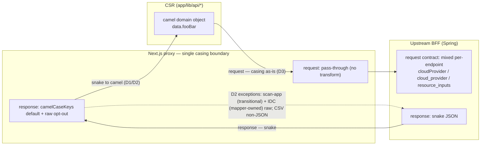

# ADR-019: BFF Casing Boundary Consolidation and Runtime Schema Validation

## Status

**Amended 2026-06-26 — zod-codegen adopted; D1/D2/D4 revised (see "Amendment" below).** Originally Proposed (2026-06-20) — **Amends [ADR-011](./011-typed-bff-client-consolidation.md)** (does not supersede). Complements [ADR-008](./008-error-handling-strategy.md).

## Amendment (2026-06-26): swagger-driven zod codegen; snake passthrough replaces camelCaseKeys-default

The original D1/D2/D4 chose a central `camelCaseKeys`-by-default boundary plus **camelCase** zod schemas validated as `schema.parse(camelCaseKeys(data))`. Implementation pivoted to a **codegen-from-swagger** model. This amendment revises the casing/validation decisions; the rest of the ADR (Problems 1–4, D3, D5, D6, rejected alternatives) stands.

- **Single source of truth = `docs/swagger/install-v1.yaml`.** It is the *only* API contract. All other swagger specs were deleted. An endpoint absent from `install-v1.yaml` does not exist — its route and full chain (BFF method, mock, CSR fn, hand types, exclusive UI) are removed, not left as an unvalidated passthrough.
- **Codegen.** `npm run gen:api` regenerates `lib/generated/install-v1.ts` (zod schemas, `openapi-zod-client` schemas-only template, zod v3). Never hand-edit the generated file. `z.infer<typeof schemas.X>` replaces every hand-written `*Wire` DTO.
- **D1 revised — the boundary is the route's `schemas.X.parse(raw)`, not central `camelCaseKeys`.** Each route returns `NextResponse.json(schemas.X.parse(rawFromBff))`. BFF response casing is **not** transformed centrally; the generated schema *is* the contract (snake, verbatim). `lib/bff/http` exposes responses via `getSnakeRaw` (no `camelCaseKeys`).
- **D2 revised — no camelCase-by-default.** The API client returns the generated zod Response type (`z.infer`, snake) verbatim. snake→camel happens **only** inside per-need CSR *adapters* that already perform a join/reshape/compute (the IDC D2.2/D6 sanctioned-mapper pattern, generalized to the default). **No rename-only adapters.**
- **D4 revised — schemas are codegen'd from swagger (snake), validated as `schemas.X.parse(raw)`** at the route (supersedes "camelCase schema + `parse(camelCaseKeys(data))`"). `ZodError` → `ProblemDetails` via the existing ADR-008 pipeline (**loud-fail**: a contract violation surfaces at the boundary, not as a late `undefined`).
- **D7 (new) — codegen freshness gate.** CI runs `npm run gen:api` and fails if `git diff lib/generated/install-v1.ts` is non-empty (a stale generated file is a drift footgun).
- **D8 (new) — `required` discipline.** A swagger schema with no `required:` generates `.partial()` (all-optional → weak validation). Always-present fields must be declared `required:` so the generated type is non-optional and adapters need no defaults; fields left optional are a logged gap.

Known deferred contract gaps at amendment time: `POST approval-requests` body uses `resource_inputs[]` (UI) vs `resources[]` (`ApprovalRequestInputDto`) — a request reshape kept on the write path; `scan_error` needs `nullable: true`.


This ADR does two things ADR-011 explicitly left open:

1. It **resolves the GET/POST casing asymmetry** that ADR-011 deferred to "a separate post-migration ADR" (the invariant referenced in `lib/bff/http.ts:4-7` and defined as I-3 in `docs/reports/sit-migration-prompts/adr011-README.md:91-96`).
2. It **adopts ADR-011 §Scope / §Fallback "Option D (shared zod schemas)" as an added complement** — runtime validation of the upstream BFF response shape. ADR-011 called this "an optional complement to this ADR, not an alternative". This ADR promotes it from optional to adopted. **It does NOT trigger the ADR-011 §Fallback *withdrawal*** — the typed-client migration (ADR-011 Phases 2-6) continues.

## Context

### The recurring complaint

App-side API client code repeatedly inspects whether a response field arrived as `snake_case` or `camelCase` and assigns accordingly. For an engineer used to Spring/Jackson (`@JsonNaming(SnakeCaseStrategy)` applied once, globally), this reads as accidental complexity. Investigation showed the perception is directionally right but the literal "check both every time" pattern is rare — concentrated at seams such as:

```ts
// app/lib/api/index.ts:706-707
totalElements: response.page.totalElements ?? response.page.total_elements ?? 0,
totalPages:    response.page.totalPages    ?? response.page.total_pages    ?? 0,
```

The deeper cost is two structural problems below.

### Problem 1 — casing conversion is smeared across layers, applied inconsistently

A central deep key-transformer already exists (`lib/object-case.ts:39-40` `camelCaseKeys`, plus the unused `snakeCaseKeys`), i.e. the equivalent of a Jackson naming strategy. But it is invoked in **two** places with **inconsistent** rules:

- `lib/bff/http.ts:43` — proxy/server client camelCases **GET** responses, but `send()` (`http.ts:68`) returns **POST/PUT/DELETE responses raw** (snake). One endpoint (`getScanApp`, Issue #222, `http.ts:206`) opts out of camelCasing entirely via `{ raw: true }`.
- `app/lib/api/infra.ts:18-22` — CSR client camelCases **again** (`fetchInfraCamelJson`), so some paths transform twice; others (`fetchInfraJson`) stay raw and are then hand-normalized.

Both helpers see widespread use — a camel-converting path (`fetchInfraCamelJson`) and a raw path (`fetchInfraJson`) coexist across many call sites; exact counts drift as domains are added (the IDC client alone added several raw call sites in `app/lib/api/idc.ts`). The raw world feeds hand-written `normalize*` functions (`lib/approval-bff.ts`, `lib/target-source-response.ts`, etc.) that read snake fields by hand — manually re-implementing what `@JsonProperty` does for free.

### Problem 2 — the GET/POST asymmetry (I-3) is a legacy-preservation artifact, not a design

I-3 (`docs/reports/sit-migration-prompts/adr011-README.md:91-96`) exists only to preserve legacy `proxyGet`/`proxyPost` behavior **during** the ADR-011 migration: GET responses are camelCased, POST/PUT/DELETE responses pass through as snake. It has no standalone architectural justification. ADR-011 deferred its resolution to a post-migration ADR — this one.

### Problem 3 — request casing is genuinely mixed, and is the BFF's contract to dictate

The upstream BFF request contract is **not uniform**, even within a single spec file:

| Spec | Field | Casing |
|---|---|---|
| `docs/swagger/install-v1-client.yaml:741,749` | `cloudProvider`, `awsAccountId` | camelCase |
| `docs/swagger/install-v1-client.yaml:784` | `cloud_provider` | snake_case |
| `docs/swagger/azure-page-apis.yaml:948` | `cloud_provider` | snake_case |
| `docs/swagger/confirm.yaml:901` | `resource_inputs` | snake_case |

This forces an asymmetry that must be designed for explicitly:

| Direction | Consumer | Who dictates casing | Implication |
|---|---|---|---|
| **Response** | the frontend | the **frontend** | can be normalized centrally to one casing |
| **Request** | the BFF | the **BFF** (per-endpoint, mixed) | **cannot** be blanket-transformed; each endpoint must match its own contract |

A blanket `snakeCaseKeys` on all outgoing requests (a "symmetric transform") would **break** the camelCase-expecting endpoints (`cloudProvider`, `awsAccountId`). This alternative is therefore rejected (see Rejected Alternatives).

### Problem 4 — `camelCaseKeys(data) as T` is an assertion, not a check

ADR-011 §Scope already records this gap: `httpBff` uses `camelCaseKeys(data) as T`, which guarantees the *client signature* but does **not** verify that the upstream BFF actually conforms at runtime. Contract drift (the Issue #222 / PR #253 failure class) surfaces late as `undefined`, not at the boundary. ADR-011 named the remedy: Option D (zod). The repo's swagger specs are partly stale (e.g. `aws.yaml`/`gcp.yaml` unchanged since 2026-03-23), which makes runtime drift a live risk rather than a theoretical one.

## Decision

### Diagram — the casing boundary



The asymmetry is intrinsic: **response** casing is the frontend's to choose (normalize centrally to camel), while **request** casing is the BFF's contract (per-endpoint, mixed — cannot be blanket-transformed).

### D1 — A single casing boundary: the proxy (`lib/bff/*`)

All response casing normalization happens **once**, in the proxy client (`lib/bff/*`). CSR helpers (`app/lib/api/*`) and route handlers receive already-normalized data and perform **no** casing conversion. The redundant second transform in `app/lib/api/infra.ts` (`fetchInfraCamelJson`) is removed; CSR consumes the proxy's typed output directly.

### D2 — Responses: camelCase by default; opt-outs are narrow

The default for every JSON response is `camelCaseKeys`. Three concerns are distinguished; only the first is a permanent, sanctioned bypass:

1. **Non-JSON payloads** (binary / CSV export, e.g. `dashboard.systemsExport`) use the separate `getRaw` method — it returns the raw `Response` and parses nothing. Permanent and legitimate: there are no JSON keys to convert, so this is not a camelCase opt-out at all.

2. **`get(..., { raw: true })` (skip camelCasing on a JSON body) is allowed in two explicit forms only — never as a silent generic escape:**
   - **Transitional (retire):** `azure.getScanApp` (Issue #222), a verbatim snake passthrough whose public V1 contract is snake — a migration artifact of the I-3 kind ("the upstream is snake" is no reason; *every* upstream response is snake). It migrates to camelCase (V1 contract + consumer in lockstep) alongside D5, after which its `raw: true` is removed.
   - **Sanctioned (keep):** a domain that provides a **dedicated, isolated wire→domain mapper** instead of the generic `camelCaseKeys` boundary — as **IDC** does (`lib/bff/http.ts:219-231` raw passthrough; `app/lib/api/idc.ts` owns the snake→domain conversion, per `design/idc-implementation-plan.md` §5). This is an explicit, typed *alternative* boundary (consistent with D6), not a footgun; ADR-019 does **not** override the IDC v15 design, so this `raw: true` stays.

   No `raw: true` may be added outside these two forms.

3. **Maps whose keys are data, not field names** are handled at the field level — never with whole-response `raw: true` (which would leave the entire response snake to protect one sub-object). An audit found one: `resource_count_by_resource_type: Record<string, number>` (`lib/bff/types/scan.ts:36`), keyed by resource-type values. It survives `camelCaseKeys` today only **by accident** — its keys are UPPERCASE enum values (`RDS_CLUSTER`, `AZURE_MSSQL`) that the `_([a-z0-9])` boundary regex never matches — a latent corruption risk the moment a lower-case key appears. `camelCaseKeys` must treat such a value as opaque (transform only known DTO keys, or skip the field's value). This is a correctness requirement, not a `raw: true` use case.

### D3 — Requests: pass-through, no blanket transform

Outgoing request bodies are **not** globally transformed. `snakeCaseKeys` is **not** applied across the board. Each request body matches its endpoint's contract casing, carried by a typed request body (sourced from the swagger contract — hand-written today, codegen-eligible later). This is the only correct handling for the mixed request contract (Problem 3). The current `send()` pass-through (`http.ts:68` for the request body) is retained for requests.

### D4 — Adopt runtime validation (zod) at the proxy boundary (ADR-011 Option D)

Replace `camelCaseKeys(data) as T` with `schema.parse(camelCaseKeys(data))` at the proxy, where `schema` is a zod schema declared in **camelCase** (matching the post-`camelCaseKeys` shape). `z.infer<typeof schema>` supplies the static type, removing hand-written DTO drift.

- **Rollout is incremental, not big-bang.** Start with high-risk / high-value responses (approval, installation status, process-status); the `as T` assertion remains acceptable elsewhere until migrated. Coverage gaps are logged, never silent.
- **Failure handling reuses the existing error pipeline.** A `ZodError` at the proxy means "upstream returned a shape that violates the contract." It is converted to a `ProblemDetails` (`app/api/_lib/problem.ts`) using an **existing** server error code (an `INTERNAL_ERROR` / upstream-fault class), then flows through ADR-008 Layer 1 (`fetchJson` → `AppError`) unchanged. The client `AppErrorCode` taxonomy is **not** widened (respects ADR-008's ADR-013 amendment, point 3).

### D5 — Retire I-3: responses become symmetric (GET and POST both camelCase)

The end state is symmetric: **all** responses are camelCase (subject to D2 opt-outs), GET and POST alike. Reaching it requires flipping POST/PUT/DELETE responses to camelCase **and** migrating the snake-consuming `normalize*` functions in lockstep (`createApprovalRequest` `app/lib/api/index.ts:375`, `getApprovalHistory:484`, `approve/reject:530,548`, etc.).

This work is **sequenced with ADR-011 Phase 6**, which already plans to "drop defensive normalization where the BFF typed response already matches." Until Phase 6 lands, I-3 (POST raw) remains in force but is now **scheduled for retirement**, not indefinite. No new code may add snake-consuming normalization on the POST path.

### D6 — Surface casing/validation exceptions in the API, not in comments

The bugs this ADR addresses were invisible because the concern lived in behavior or comments, not in types or method names — Issue #222's boolean `{ raw: true }`, and the `resource_count_by_resource_type` map that is safe only by accident (D2.3). **Any migration or refactoring done under this ADR must make each exception visible at the method/type level**, so a reviewer sees it in the signature and can grep for it — never discovers it in a comment or by luck.

- **Snake passthrough = a named, greppable method, not a boolean flag.** Retire `get(..., { raw: true })` for an explicit entry point whose return type carries the exception:

  ```ts
  // avoid — silent footgun, invisible at the call site
  get<T>(path, { raw: true })

  // prefer — the exception is in the name and the type
  getSnakeRaw<T>(path): Promise<SnakeRaw<T>>   // branded; camelCaseKeys never runs
  ```

  IDC already approximates this — raw passthrough plus a dedicated `app/lib/api/idc.ts` mapper documented in code — and is the model: a domain may keep its own typed wire→domain mapper as long as the opt-out is explicit, not a silent flag.

- **Opaque dynamic-key fields are expressed in the type, not left to luck.** Mark a data-keyed map so `camelCaseKeys` provably skips its value:

  ```ts
  // keys are data ("RDS_CLUSTER"), not field names — must not be camelCased
  resourceCountByResourceType: OpaqueKeys<Record<string, number>>
  ```

  `camelCaseKeys` honors `OpaqueKeys` (or an explicit per-call skip-list), turning D2.3's accidental safety into a type-enforced guarantee.

- **Validated vs unchecked responses differ in the signature.** A `schema.parse(...)` path (D4) and any remaining `as T` path read differently at the call site, keeping the unchecked surface visible and shrinking.

Intent: a **loud API** — every exception to the default casing/validation rule is greppable and type-checked, never silent.

## Consequences

### Positive

- One casing boundary, one rule. The `?? snake ?? camel` seams (e.g. `index.ts:706-707`) lose their reason to exist.
- The double transform (`http.ts` + `infra.ts`) collapses to one; CSR stops re-converting.
- zod catches upstream contract drift **at the boundary** instead of as a late `undefined` — directly addressing the Issue #222 / PR #253 failure class that motivated ADR-011.
- `z.infer` retires a class of hand-written, drift-prone DTOs.
- Restores the Spring/Jackson mental model: casing is handled once at the edge; contract drift is a loud failure.

### Negative / Trade-offs

- D5 is non-mechanical: every POST/PUT/DELETE response consumer that reads snake must migrate in lockstep with the flip. Gated behind ADR-011 Phase 6 to avoid a mid-migration behavior change.
- zod adds runtime cost on validated paths and a schema to maintain per covered response (mitigated by incremental rollout and, later, schema codegen).
- Two casing conventions (camel response domain, mixed request bodies) still coexist by necessity — this is inherent to the BFF contract (Problem 3), not removable by the frontend.
- zod schemas must stay in sync with `camelCaseKeys` output rules; both transforms must share one casing definition (`lib/object-case.ts`).

### Rejected alternatives

- **Symmetric request transform (blanket `snakeCaseKeys` on all requests).** Rejected: the BFF request contract is per-endpoint mixed (Problem 3); a global transform would break camelCase-expecting endpoints. (This corrects an earlier proposal made during design discussion.)
- **Make the BFF emit camelCase responses (fix at source).** Cleanest in theory, but a breaking change to a contract with potentially multiple consumers, and outside this repo's ownership; deferred to a BFF-side decision if/when the BFF team owns it as the sole consumer.
- **Withdraw ADR-011 and pivot to zod-only (ADR-011 §Fallback).** Not chosen: the typed-client migration is mid-flight (W1 complete) and its compile-time mock/BFF parity is valuable and orthogonal to casing/validation. zod is adopted as the *complement* ADR-011 always permitted, not as a replacement.
- **Full TanStack Query + zod rewrite (ADR-011 Option C).** Out of scope, as in ADR-011.

### Migration outline

| Step | Scope | Gating |
|---|---|---|
| 1 | Remove CSR-side double transform; route all response casing through the proxy (D1) | Safe now (GET already camel) |
| 2 | Confirm `getRaw` (non-JSON) usages; make `camelCaseKeys` treat the `resource_count_by_resource_type` map keys as opaque (D2.3) | Safe now |
| 3 | Introduce zod schemas for high-risk responses; swap `as T` → `schema.parse(...)`; wire `ZodError` → ProblemDetails (D4) | Incremental |
| 4 | Flip POST/PUT/DELETE responses to camelCase + migrate snake `normalize*` consumers (D5, retires I-3); retire the transitional `getScanApp` `raw: true` (V1 contract + consumer → camel). IDC's mapper-owned raw passthrough is intentional and unaffected. | **ADR-011 Phase 6** |

## Relationship to existing ADRs

- **ADR-011** — *Amended, not superseded.* The typed-client consolidation stands. This ADR fills its two declared gaps (post-migration casing resolution; Option D adoption) and gives Phase 6 its casing target. ADR-011 status updated to note the amendment.
- **ADR-008** — *Referenced, not amended.* Proxy-side validation failures become a new producer of `ProblemDetails` that flows through ADR-008's existing Layer 1/Layer 2 pipeline using an existing code; ADR-008's design is unchanged.
- **No ADR is deprecated or superseded** by this decision. All other ADRs are unrelated in scope.

## Related Files

- `lib/object-case.ts` — `camelCaseKeys` / `snakeCaseKeys`; the single casing rule (D1, D4)
- `lib/bff/http.ts` — proxy client; site of D1/D2/D4 changes (`get()`/`send()`/`raw`)
- `lib/bff/types/scan.ts:36` — `resource_count_by_resource_type` dynamic-key map (D2.3 opaque-key handling)
- `lib/bff/http.ts:219-231`, `app/lib/api/idc.ts`, `lib/bff/types/idc.ts` — IDC raw passthrough + dedicated mapper (sanctioned D2 exception, not retired)
- `app/lib/api/infra.ts` — CSR client; redundant transform removed (D1)
- `app/lib/api/index.ts` — `?? snake ?? camel` seams (706-707) and POST snake consumers (375, 484, 530, 548) migrated under D5
- `lib/approval-bff.ts`, `lib/target-source-response.ts`, `lib/confirmed-integration-response.ts` — hand-written `normalize*` revisited under D4/D5
- `app/api/_lib/problem.ts` — `ZodError` → `ProblemDetails` mapping (D4)
- `docs/reports/sit-migration-prompts/adr011-README.md:91-96` — the I-3 GET-camelCase / POST-raw response invariant (retired by D5)
- `docs/swagger/*.yaml` — request/response contracts; source for typed bodies and zod schemas
- `docs/adr/011-typed-bff-client-consolidation.md` — amended by this ADR
