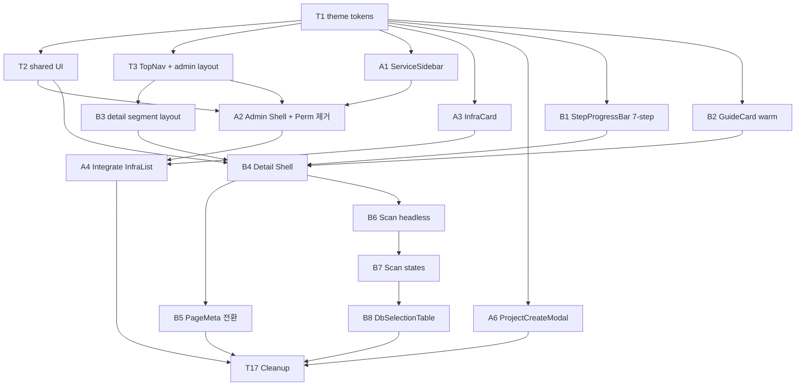

# SIT Migration — Session Execution Graph & Prompts

**작성일**: 2026-04-22
**목적**: Phase 1 Todo 18개를 Claude Code Opus 4.7 세션이 독립적으로 수행 가능하도록 **실행 그래프 + 자가완결 프롬프트**로 분해
**상위 문서**: [`sit-prototype-migration-plan.md`](./sit-prototype-migration-plan.md) / [`sit-migration-todo-phase1.md`](./sit-migration-todo-phase1.md)

---

## 0. 세션 운영 규칙

1. **각 세션 = 1개 Todo = 1개 PR**. Todo ID를 브랜치명 접미사로 사용.
2. 세션 시작 시 **필독 문서 2개**를 반드시 Read:
   - `docs/reports/sit-migration-todo-phase1.md` (전체 + 해당 Todo §)
   - `docs/reports/sit-prototype-migration-plan.md` (해당 섹션)
3. **각 Wave 내 Todo는 병렬 실행 가능**. Wave를 넘기 전 모든 PR merge 확인.
4. Worktree 필수 (⛔ main 직접 수정 금지): `bash scripts/create-worktree.sh --topic <topic> --prefix <prefix>`
5. PR 전 rebase 필수: `git fetch origin main && git rebase origin/main`
6. 디자인 토큰(`lib/theme.ts`) 경유, raw hex 금지. TypeScript any 금지. 상대 경로 import 금지.

---

## 1. 실행 그래프

```
                                          ┌─ T1 (theme tokens) ─────────────────┐
                                          │        [Wave 1 · 단일]                │
                                          └──────────────┬──────────────────────┘
                                                         │
          ┌──────────────┬──────────────┬────────────────┼──────────────┬──────────────┬────────────────┐
          ▼              ▼              ▼                ▼              ▼              ▼                ▼
  ┌───────────┐  ┌───────────┐  ┌───────────┐    ┌───────────┐  ┌───────────┐  ┌───────────┐    ┌───────────┐
  │ T2 shared │  │ T3 TopNav │  │ A1 Service│    │ A3 InfraC │  │ A6 Create │  │ B1 Stepper│    │ B2 Guide  │
  │   UI      │  │ + layout  │  │  Sidebar  │    │    ard    │  │   Modal   │  │           │    │   Card    │
  └─────┬─────┘  └─────┬─────┘  └─────┬─────┘    └─────┬─────┘  └─────┬─────┘  └─────┬─────┘    └─────┬─────┘
        │              │              │                │              │              │                │
        │              ▼              │                │              │              │                │
        │         ┌──────┐           │                │              │              │                │
        │         │  B3  │           │                │              │              │                │
        │         │detail│           │                │              │              │                │
        │         │layout│           │                │              │              │                │
        │         └──┬───┘           │                │              │              │                │
        │            │               │                │              │              │                │
        │   [Wave 2 · 7개 병렬 + B3는 T3 직후]                                                      │
        │            │               │                │              │              │                │
        └────────────┴───────────────┴────────────────┤              │              │                │
                                                       │              │              │                │
                ┌──────────────┐                       │              │              │                │
                │   Wave 3     │                       │              │              │                │
                │  A2 Admin    │←──── (A2 depends on T2,T3,A1)        │              │                │
                │    Shell     │                       │              │              │                │
                │ + Perm 제거 │                       │              │              │                │
                └───────┬──────┘                       │              │              │                │
                        │                              │              │              │                │
                        │     ┌──── (A4 depends on A2, A3) ───────────┘              │                │
                        │     │                                                       │                │
                        ▼     ▼                                                       │                │
                ┌──────────────┐         ┌─────────────────────────────┐              │                │
                │  Wave 4a     │         │    Wave 4b (B4)             │              │                │
                │  A4 Integrate│         │  Detail Shell (5 provider)  │←──────────── (B4: T2 + B1 + B2 + B3)
                │  InfraCard   │         └───────────┬─────────────────┘              │                │
                └──────────────┘                     │                                 │                │
                                     ┌───────────────┼────────────────┐               │                │
                                     ▼                                ▼                                │
                            ┌──────────────┐                ┌──────────────┐                          │
                            │  Wave 5a B5  │                │  Wave 5b B6  │                          │
                            │ PageMeta전환 │                │ Scan headless│                          │
                            └──────────────┘                └───────┬──────┘                          │
                                                                    │                                  │
                                                                    ▼                                  │
                                                           ┌──────────────┐                           │
                                                           │  Wave 6 B7   │                           │
                                                           │  Scan states │                           │
                                                           └───────┬──────┘                           │
                                                                   │                                   │
                                                                   ▼                                   │
                                                           ┌──────────────┐                           │
                                                           │  Wave 7 B8   │                           │
                                                           │DbSelectionTbl│                           │
                                                           └───────┬──────┘                           │
                                                                   │                                   │
                                                                   ▼                                   │
                                                           ┌──────────────┐                           │
                                                           │  Wave 8 T17  │←─(A4, A6, B5, B8 전부 merge)│
                                                           │  Cleanup     │                           │
                                                           └──────────────┘                           │
```

### Mermaid



### Wave 요약

| Wave | Todo | 병렬 수 | 게이트 조건 |
|---|---|---|---|
| 1 | T1 | 1 | - |
| 2 | T2, T3, A1, A3, A6, B1, B2 | 7 | T1 merged |
| 2b | B3 | 1 | T3 merged (Wave 2 내 순차 1건) |
| 3 | A2 | 1 | T2, T3, A1 merged |
| 4a | A4 | 1 | A2, A3 merged |
| 4b | B4 | 1 | T2, B1, B2, B3 merged |
| 5a | B5 | 1 | B4 merged |
| 5b | B6 | 1 | B4 merged |
| 6 | B7 | 1 | B6 merged |
| 7 | B8 | 1 | B7 merged |
| 8 | T17 | 1 | A4, A6, B5, B8 merged |

**병렬 최대치**: Wave 2에서 **7개 세션 동시** 가능. 그 외는 1-2개.

---

## 2. 노드별 프롬프트

각 프롬프트는 **복붙하여 새 세션에 전달**하면 즉시 착수 가능한 형식입니다.

---

### ⬛ T1 — 디자인 토큰 확장 (`lib/theme.ts`)

```
## Task: T1 — 디자인 토큰 확장

### 작업 디렉토리 설정 (최초 1회)
bash scripts/create-worktree.sh --topic sit-t1-theme --prefix feat
cd /Users/study/pii-agent-demo-sit-t1-theme

### 필독 (순서 준수)
1. Read: docs/reports/sit-migration-todo-phase1.md §T1 (전체 스펙)
2. Read: docs/reports/sit-prototype-migration-plan.md §4-1 (토큰 예시)
3. Read: lib/theme.ts (현행 토큰 확인)

### 목표
후속 Todo가 raw hex 없이 사용할 수 있도록 lib/theme.ts에 다음 4개 섹션 추가:
- navStyles (TopNav 전용 · slate-900 + 브랜드 그라디언트)
- cardStyles.warmVariant (GuideCard 용 · amber-50 계열)
- tagStyles (blue/gray/green/red/orange/amber)
- mgmtGroupStyles (관리 split 버튼)

### 구현 범위
- lib/theme.ts에만 작업. 다른 파일 건드리지 말 것.
- 기존 토큰명과 충돌 없는지 grep 선행.
- brandGradient의 raw hex는 브랜드 색으로 예외 허용하되 상수로 1회 정의.

### 검증
- npm run type-check
- npm run lint
- grep -n 'navStyles\|warmVariant\|tagStyles\|mgmtGroupStyles' lib/theme.ts 로 신규 export 확인

### 완료 액션
git add lib/theme.ts
git commit -m "feat(theme): SIT 디자인 토큰 확장 (nav/warm-variant/tag/mgmt)"
git fetch origin main && git rebase origin/main
git push -u origin feat/sit-t1-theme
gh pr create --title "feat(theme): SIT 디자인 토큰 확장 (T1)" --body "(상세: docs/reports/sit-migration-todo-phase1.md §T1)"

### 선행 조건
없음 (Wave 1)

### 후행 Todo
T2, T3, A1, A3, A6, B1, B2 (이 PR merge 후 동시 착수 가능)
```

---

### ⬛ T2 — 공통 UI 컴포넌트 (Breadcrumb · PageHeader · PageMeta)

```
## Task: T2 — 공통 UI primitives

### 작업 디렉토리
bash scripts/create-worktree.sh --topic sit-t2-shared-ui --prefix feat
cd /Users/study/pii-agent-demo-sit-t2-shared-ui

### 필독
1. docs/reports/sit-migration-todo-phase1.md §T2
2. docs/reports/sit-prototype-migration-plan.md §3-3-a, §3-3-b
3. design/SIT Prototype.html L157-172 (시안 참조)

### 목표
app/components/ui/ 에 Breadcrumb, PageHeader, PageMeta 3종 primitive 신규 작성.

### 구현 범위
- Breadcrumb: crumbs={label, href?}[]. 마지막 항목 href 없으면 current. <nav aria-label="breadcrumb"> 감싸기.
- PageHeader: title + optional subtitle + action(우측) + backHref(좌측 ← 목록으로 ghost 버튼).
- PageMeta: items={label, value}[]. flex flex-wrap gap-7.

### 스타일 토큰
lib/theme.ts의 textColors, borderColors 등 재사용. raw hex 금지.

### 검증
- npm run type-check, lint
- 임시로 app/integration/admin/page.tsx에 mount하여 시각 확인 후 되돌림.

### 완료 액션
git add app/components/ui/
git commit -m "feat(ui): Breadcrumb / PageHeader / PageMeta 공통 primitive 추가"
git push -u origin feat/sit-t2-shared-ui
gh pr create --title "feat(ui): 공통 primitive Breadcrumb/PageHeader/PageMeta (T2)"

### 선행 조건
T1 merged

### 후행 Todo
A2, B4, B5
```

---

### ⬛ T3 — TopNav + admin segment layout

```
## Task: T3 — TopNav + admin layout

### 작업 디렉토리
bash scripts/create-worktree.sh --topic sit-t3-topnav --prefix feat
cd /Users/study/pii-agent-demo-sit-t3-topnav

### 필독
1. docs/reports/sit-migration-todo-phase1.md §T3
2. docs/reports/sit-prototype-migration-plan.md §3-1
3. design/SIT Prototype.html L28-75 (TopNav 시안)
4. lib/routes.ts (현행 라우트)

### 목표
- app/components/layout/TopNav.tsx 신규
- app/integration/admin/layout.tsx 신규 (TopNav 주입)
- 루트 app/layout.tsx는 건드리지 않음 (타겟소스 상세는 TopNav 없음)
- lib/routes.ts에 미구현 메뉴 상수 3개 추가

### 핵심 규칙
- 미구현 메뉴(Credentials / PII Tag / PII Map)는 표시는 하되, 클릭 시 "Coming soon" 토스트. (I-08 확정)
- active 판정은 pathname.startsWith('/integration/admin')로 느슨하게.
- 좌측 브랜드는 navStyles.brandGradient(T1) 사용.

### 검증
- /integration/admin 접속 시 TopNav 노출, Service List 활성
- /integration/projects/123 접속 시 TopNav 없음 (루트 레이아웃으로 fallback)
- 미구현 메뉴 클릭 시 토스트 노출

### 완료 액션
git add app/components/layout/TopNav.tsx app/integration/admin/layout.tsx lib/routes.ts
git commit -m "feat(layout): TopNav + admin segment layout (T3)"
git push -u origin feat/sit-t3-topnav
gh pr create --title "feat(layout): TopNav + admin segment layout (T3)"

### 주의
- lib/routes.ts를 B3도 수정하므로 같이 진행 시 merge 충돌 가능. 먼저 착수하면 경로 상수 3개 함께 추가.
- 토스트 라이브러리 확인. 없으면 최소 구현 (alert 아님).

### 선행 조건
T1 merged

### 후행 Todo
A2, B3
```

---

### ⬛ A1 — ServiceSidebar 개편

```
## Task: A1 — ServiceSidebar 개편

### 작업 디렉토리
bash scripts/create-worktree.sh --topic sit-a1-sidebar --prefix feat
cd /Users/study/pii-agent-demo-sit-a1-sidebar

### 필독
1. docs/reports/sit-migration-todo-phase1.md §A1
2. docs/reports/sit-prototype-migration-plan.md §3-2
3. design/SIT Prototype.html L80-147 (시안)
4. app/components/features/admin/ServiceSidebar.tsx (현행)

### 목표
ServiceSidebar 폭·타이포·선택 스타일·하단 푸터를 시안대로 개편.

### 변경 매트릭스
- 너비 w-64 → w-[280px]
- 타이틀 "서비스 코드" → "Service List" (15px font-semibold)
- 검색 placeholder: "Service name or Service Code"
- 선택 스타일: 좌측 4px bar → primary-50 배경 + 1px primary 전체 테두리
- 아이템 구조: code + name (projectCount 배지 제거)
- 하단 푸터: pager + 구분선 + Notice/Guide/FAQ 링크 3개 (링크는 # 임시)

### 검증
- /integration/admin 에서 서비스 선택/검색/페이지네이션 정상

### 완료 액션
git add app/components/features/admin/ServiceSidebar.tsx
git commit -m "feat(admin): ServiceSidebar 시안 기반 개편 (A1)"
git push -u origin feat/sit-a1-sidebar
gh pr create --title "feat(admin): ServiceSidebar 개편 (A1)"

### 주의
- projectCount 배지 제거하되 AdminDashboard에서 prop은 유지 (A2에서 정리).

### 선행 조건
T1 merged

### 후행 Todo
A2
```

---

### ⬛ A3 — InfraCard 서브컴포넌트 6개 신규 구현

```
## Task: A3 — InfraCard 컴포넌트 세트

### 작업 디렉토리
bash scripts/create-worktree.sh --topic sit-a3-infracard --prefix feat
cd /Users/study/pii-agent-demo-sit-a3-infracard

### 필독
1. docs/reports/sit-migration-todo-phase1.md §A3 (핵심 스펙 — expand 규칙 3가지 포함)
2. docs/reports/sit-prototype-migration-plan.md §3-3-d
3. design/SIT Prototype.html L223-330, L873-968
4. app/components/features/process-status/ConfirmedIntegrationCollapse.tsx (lazy fetch 패턴 참조)
5. app/components/features/admin/ProjectsTable.tsx (ProcessStatus별 CTA 로직 이관용)

### 목표
app/components/features/admin/infrastructure/ 디렉토리 신규 생성, 7개 파일 구현.

### 파일 구조
- InfrastructureList.tsx (컨테이너)
- InfraCard.tsx (아코디언 1개)
- InfraCardHeader.tsx (헤더 row: provider bar + kv-inline + status CTA + 관리 split)
- InfraCardBody.tsx (expanded 시 lazy fetch + 렌더)
- InfraDbTable.tsx (DB 목록 6컬럼)
- InfrastructureEmptyState.tsx
- ManagementSplitButton.tsx
- index.ts

### ⚠️ I-02 expand 규칙 (중요)
1. chevron 활성 조건: project.cloudProvider !== 'IDC' && !== 'SDU' && project.processStatus >= INSTALLING
2. IDC/SDU: chevron 자체 DOM 없음
3. expand 클릭 시에만 getConfirmedIntegration(targetSourceId) 호출 + 컴포넌트 state에 캐시. 재expand 시 재호출 X.

### 헤더 우측 배치
[status-aware CTA] [관리 ▾ split 버튼] — ProjectsTable의 CTA 로직 그대로 이관.

### 주의
- AdminDashboard와 연결은 A4 범위 (이 Todo는 UI + 로컬 state만).
- Mock ProjectSummary 3종 (AWS/INSTALLED · Azure/WAITING_APPROVAL · IDC)으로 chevron 매트릭스 테스트 권장.
- ConfirmedIntegrationCollapse.tsx를 그대로 복제하지 말고 InfraCard 내부에 lazy fetch hook으로 구현.

### 검증
- npm run type-check, lint
- 로컬 렌더 확인 (임시 mount 후 되돌림)

### 완료 액션
git add app/components/features/admin/infrastructure/
git commit -m "feat(admin): InfraCard 컴포넌트 세트 신규 (A3)"
git push -u origin feat/sit-a3-infracard
gh pr create --title "feat(admin): InfraCard 컴포넌트 세트 (A3)"

### 선행 조건
T1 merged

### 후행 Todo
A4
```

---

### ⬛ A6 — ProjectCreateModal 전면 재작성

```
## Task: A6 — ProjectCreateModal 재작성

### 작업 디렉토리
bash scripts/create-worktree.sh --topic sit-a6-create-modal --prefix feat
cd /Users/study/pii-agent-demo-sit-a6-create-modal

### 필독
1. docs/reports/sit-migration-todo-phase1.md §A6 (전체 스펙 — State/핵심 로직/매핑 상수 포함)
2. docs/reports/sit-prototype-migration-plan.md §3-4
3. design/SIT Prototype.html L1181-1332 (시안)
4. app/components/features/ProjectCreateModal.tsx (현행 · 전면 재작성)
5. app/lib/api/index.ts의 createProject 시그니처 (필드 지원 여부 확인)

### 목표
840px 모달, 7-chip(활성 4 + disabled 3), 누적형 staged list, Promise.all(createProject) 병렬 생성, DB Type 6종 정적.

### 활성 / Disabled
- 활성 4: AWS Global / AWS China / Azure / GCP
- Disabled 3 (배지 "준비중"): IDC/On-prem, Other Cloud/IDC, SaaS

### 신규 파일
- app/components/features/project-create/ProviderChipGrid.tsx
- app/components/features/project-create/ProviderCredentialForm.tsx
- app/components/features/project-create/DbTypeMultiSelect.tsx
- app/components/features/project-create/StagedInfraTable.tsx
- app/components/features/project-create/index.ts
- lib/constants/db-types.ts (mysql/mssql/postgresql/athena/redshift/bigquery)
- lib/constants/provider-mapping.ts (PROVIDER_CHIPS 상수)

### API 시그니처 확인 포인트
- createProject이 linkedAccountId, dbTypes 필드를 받는지 확인.
- 없으면 PR description에 미지원 필드 목록 명시 후 drop하고 진행 (BFF 확장은 후속 이슈).

### 핵심 로직
- Save 시 Promise.allSettled로 성공/실패 row별 표시. 성공한 것은 리스트에서 제거, 실패는 에러 표시.
- ProjectCreateModal 외부 props 시그니처는 유지 (selectedServiceCode, serviceName, onClose, onCreated).

### 검증
- 활성 chip 전환 시 필드 교체 동작
- Add to List 버튼으로 누적 + × 버튼으로 삭제 가능
- Save 시 createProject 다중 호출 (브라우저 Network 탭)
- disabled chip 클릭 시 무반응 + Tooltip "추후 지원 예정"
- 기존 AdminDashboard의 호출부가 깨지지 않는지

### 완료 액션
git add app/components/features/ProjectCreateModal.tsx app/components/features/project-create/ lib/constants/db-types.ts lib/constants/provider-mapping.ts
git commit -m "feat(admin): ProjectCreateModal 840px 누적형 재작성 (A6)"
git push -u origin feat/sit-a6-create-modal
gh pr create --title "feat(admin): ProjectCreateModal 840px 누적형 재작성 (A6)"

### 선행 조건
T1 merged

### 후행 Todo
T17
```

---

### ⬛ B1 — StepProgressBar 7-step 확장

```
## Task: B1 — StepProgressBar 7-step

### 작업 디렉토리
bash scripts/create-worktree.sh --topic sit-b1-stepper --prefix feat
cd /Users/study/pii-agent-demo-sit-b1-stepper

### 필독
1. docs/reports/sit-migration-todo-phase1.md §B1
2. docs/reports/sit-prototype-migration-plan.md §3-5-c
3. design/SIT Prototype.html L1004-1030 (7-step 라벨)
4. app/components/features/process-status/StepProgressBar.tsx (현행 6-step)
5. lib/process.ts의 getProjectCurrentStep

### 목표
6-step → 7-step. Step 06 "관리자 승인 대기"는 CONNECTION_VERIFIED 상태에 매핑 (I-04: enum 불변).

### 7-step 매핑
01. 연동 대상 DB 선택 ← WAITING_TARGET_CONFIRMATION
02. 연동 대상 승인 대기 ← WAITING_APPROVAL
03. 연동 대상 반영중 ← APPLYING_APPROVED
04. Agent 설치 ← INSTALLING
05. 연결 테스트 (N-IRP 연동) ← WAITING_CONNECTION_TEST
06. 관리자 승인 대기 ← CONNECTION_VERIFIED
07. 완료 ← INSTALLATION_COMPLETE

### 스타일 변경
- 원 40x40 (현행 32x32)
- current: box-shadow halo (0 0 0 4px rgba(0,100,255,0.15))
- 숫자: zero-padded "01"…"07"
- connector 높이 2px
- step clickable + hover 시 border-primary + text-primary

### 검증
- 각 ProcessStatus에 대해 Stepper 렌더 결과 시각 확인
- onGuideClick prop 유지 (호출부 깨지지 않음)
- 기존 호출처(ProcessStatusCard, StepGuide 등) 정상

### 완료 액션
git add app/components/features/process-status/StepProgressBar.tsx
git commit -m "feat(process): StepProgressBar 7-step 확장 (B1)"
git push -u origin feat/sit-b1-stepper
gh pr create --title "feat(process): StepProgressBar 7-step 확장 (B1)"

### 선행 조건
T1 merged

### 후행 Todo
B4
```

---

### ⬛ B2 — GuideCard (warm variant) + 콘텐츠 매핑

```
## Task: B2 — GuideCard warm variant

### 작업 디렉토리
bash scripts/create-worktree.sh --topic sit-b2-guide-card --prefix feat
cd /Users/study/pii-agent-demo-sit-b2-guide-card

### 필독
1. docs/reports/sit-migration-todo-phase1.md §B2
2. docs/reports/sit-prototype-migration-plan.md §3-5-d
3. design/SIT Prototype.html L576-640 (warm variant CSS), L1453-1518 (7-step 콘텐츠)
4. lib/constants/process-guides.ts (현행)
5. app/components/features/process-status/StepGuide.tsx, ProcessGuideStepCard.tsx (기존 가이드 컴포넌트)

### 목표
- 신규 app/components/features/process-status/GuideCard.tsx
- lib/constants/process-guides.ts에 7-step 콘텐츠 병합

### 시각 스펙
- 카드 배경 cardStyles.warmVariant.container (amber-50/40 + amber-200 border, T1에서 정의됨)
- 헤더 그라디언트 + 💡 노란 원형 아이콘
- 본문: h4 14px 700, p 13px, ul li marker text-primary 파랑

### 컴포넌트 API
interface GuideCardProps {
  currentStep: ProcessStatus;
  provider: CloudProvider;
  installationMode?: 'AUTO' | 'MANUAL';
}

### 주의
- 기존 ProcessGuideStepCard / StepGuide 와 **병존**. 이 Todo는 신규 컴포넌트 추가만. B4에서 사용처 전환 시 기존 컴포넌트 폐기 여부 결정.
- 시안의 HTML을 그대로 복사하지 말고 React JSX로 구조화.

### 검증
- 각 step (1~7)별 콘텐츠 스위칭 로컬 렌더 확인
- installationMode AUTO/MANUAL 분기 (AWS 한정)

### 완료 액션
git add app/components/features/process-status/GuideCard.tsx lib/constants/process-guides.ts
git commit -m "feat(process): GuideCard warm variant + 7-step 콘텐츠 (B2)"
git push -u origin feat/sit-b2-guide-card
gh pr create --title "feat(process): GuideCard warm variant (B2)"

### 선행 조건
T1 merged

### 후행 Todo
B4
```

---

### ⬛ B3 — 타겟소스 상세 segment layout

```
## Task: B3 — Detail segment layout

### 작업 디렉토리
bash scripts/create-worktree.sh --topic sit-b3-detail-layout --prefix feat
cd /Users/study/pii-agent-demo-sit-b3-detail-layout

### 필독
1. docs/reports/sit-migration-todo-phase1.md §B3
2. docs/reports/sit-prototype-migration-plan.md §3-5-a (상세 Shell 설계)

### 목표
app/integration/projects/[projectId]/layout.tsx 신규 생성하여 TopNav 없는 단일 flat 레이아웃 고정.

### 구현
```tsx
export default function ProjectDetailLayout({ children }: { children: React.ReactNode }) {
  return <div className="min-h-screen bg-slate-50">{children}</div>;
}
```

### 주의
- 현행 ProjectDetail이 자체 배경을 가지고 있다면 중복 스타일 지양.
- T3가 admin layout에만 TopNav를 넣기로 한 것과 짝을 이루는 안전장치.

### 검증
- /integration/projects/123 접속 시 TopNav 없음 유지
- /integration/admin은 영향 없음

### 완료 액션
git add app/integration/projects/[projectId]/layout.tsx
git commit -m "feat(layout): 타겟소스 상세 segment layout (B3)"
git push -u origin feat/sit-b3-detail-layout
gh pr create --title "feat(layout): 타겟소스 상세 segment layout (B3)"

### 선행 조건
T3 merged

### 후행 Todo
B4
```

---

### ⬛ A2 — AdminDashboard Shell 재구성 + PermissionsPanel 완전 제거

```
## Task: A2 — Admin Shell + Perm 제거

### 작업 디렉토리
bash scripts/create-worktree.sh --topic sit-a2-admin-shell --prefix feat
cd /Users/study/pii-agent-demo-sit-a2-admin-shell

### 필독
1. docs/reports/sit-migration-todo-phase1.md §A2 (I-01 PermissionsPanel 삭제 반영)
2. app/components/features/AdminDashboard.tsx (현행)
3. app/components/features/admin/PermissionsPanel.tsx (삭제 대상)

### 목표
1. AdminHeader 제거 (TopNav가 대체)
2. Breadcrumb + PageHeader + PageMeta 삽입
3. **PermissionsPanel 완전 제거**: UI + 상태 + 핸들러 + API 호출
4. grid-cols-[320px_1fr] → 단일 컬럼 (ProjectsTable만)

### ⚠️ 이번 Todo에서 건드리지 말 것
- ProjectsTable은 그대로 유지 (A4에서 교체)

### 변경 파일
- 수정: app/components/features/AdminDashboard.tsx
- 삭제: app/components/features/admin/PermissionsPanel.tsx
- 수정: app/components/features/admin/index.ts (PermissionsPanel export 제거)

### 보존 (삭제 금지 — dead code로 유지)
- addPermission, deletePermission, getPermissions 함수 자체
- /api/v1/.../permissions/* route.ts
- mock permissions 데이터

### 검증
- /integration/admin 정상 렌더
- 서비스 선택/검색/페이지네이션 회귀 없음
- ProjectsTable의 액션 버튼 모두 정상
- UserSearchInput 사용처 grep 확인 (여기뿐이면 dead code로 보존)

### 완료 액션
git add app/components/features/AdminDashboard.tsx app/components/features/admin/index.ts
git rm app/components/features/admin/PermissionsPanel.tsx
git commit -m "feat(admin): Shell 재구성 + PermissionsPanel 완전 제거 (A2)"
git push -u origin feat/sit-a2-admin-shell
gh pr create --title "feat(admin): Shell 재구성 + PermissionsPanel 제거 (A2)"

### 선행 조건
T2, T3, A1 merged

### 후행 Todo
A4
```

---

### ⬛ A4 — AdminDashboard에 InfrastructureList 통합

```
## Task: A4 — Integrate InfrastructureList

### 작업 디렉토리
bash scripts/create-worktree.sh --topic sit-a4-integrate --prefix feat
cd /Users/study/pii-agent-demo-sit-a4-integrate

### 필독
1. docs/reports/sit-migration-todo-phase1.md §A4
2. app/components/features/AdminDashboard.tsx (A2 결과물)
3. app/components/features/admin/infrastructure/ (A3 결과물)

### 목표
A2에서 Shell만 바꾼 AdminDashboard에 A3의 InfrastructureList 연결. ProjectsTable 제거.

### 변경
- AdminDashboard: <ProjectsTable> → <InfrastructureList>
- Props 리매핑 (actionLoading, onConfirmCompletion, onViewApproval 등)
- app/components/features/admin/ProjectsTable.tsx 삭제
- index.ts에서 ProjectsTable export 제거

### 검증 (필수)
5개 ProcessStatus 케이스를 mock에서 트리거 → 액션 정상:
- WAITING_APPROVAL → 승인 요청 확인 → ApprovalDetailModal
- APPLYING_APPROVED → "연동대상 반영 중" badge
- INSTALLING → "설치 진행 중" badge
- WAITING_CONNECTION_TEST → "연결 테스트 대기" badge
- CONNECTION_VERIFIED → 설치 완료 확정 → confirmInstallation
- INfraCard expand 동작 (AWS/Azure/GCP INSTALLING+)
- IDC 카드 chevron 없음
- projects.length === 0 → InfrastructureEmptyState

### 완료 액션
git add app/components/features/AdminDashboard.tsx app/components/features/admin/index.ts
git rm app/components/features/admin/ProjectsTable.tsx
git commit -m "feat(admin): InfrastructureList 통합 + ProjectsTable 제거 (A4)"
git push -u origin feat/sit-a4-integrate
gh pr create --title "feat(admin): InfrastructureList 통합 (A4)"

### 선행 조건
A2, A3 merged

### 후행 Todo
T17
```

---

### ⬛ B4 — ProjectDetail Shell 재구성 (5 provider pages)

```
## Task: B4 — Detail Shell 재구성

### 작업 디렉토리
bash scripts/create-worktree.sh --topic sit-b4-detail-shell --prefix feat
cd /Users/study/pii-agent-demo-sit-b4-detail-shell

### 필독
1. docs/reports/sit-migration-todo-phase1.md §B4 (I-03, I-07 반영)
2. docs/reports/sit-prototype-migration-plan.md §3-5
3. design/SIT Prototype.html L972-1176
4. app/projects/[projectId]/aws/AwsProjectPage.tsx (변경 패턴 기준)

### 목표
5개 *ProjectPage.tsx의 Shell을 Screen 4 기준으로 재구성.

### 신규 구조
Breadcrumb → PageHeader(backHref=admin, action=인프라삭제) → PageMeta(4kv) → StepperCard → GuideCard → TargetDbSelectionCard(ScanPanel 유지 + ResourceTable 유지)

### 제거
- ProjectSidebar 320px (I-03)
- AwsInfoCard/ProjectInfoCard를 사이드바에서 제거 (컴포넌트 파일은 보존, 사용처만 제거)
- ProjectHeader의 Header/Breadcrumb 부분 제거 (Breadcrumb 컴포넌트로 이관)

### PageMeta 4kv (I-03 확정)
- Cloud Provider: project.cloudProvider
- Subscription ID / Account ID: provider별 (Azure → subscriptionId, AWS → awsAccountId)
- Jira Link: (BFF 필드 확인; 없으면 "-")
- 모니터링 방식: provider별 "AWS Agent" / "Azure Agent" / "GCP Agent" / "SDU"

### 복귀 UX (I-07)
- Breadcrumb에 "Service List" 링크 → integrationRoutes.admin
- PageHeader backHref={integrationRoutes.admin}

### ⚠️ 이 Todo에서 건드리지 말 것
- ScanPanel 내부 (B6 범위)
- ResourceTable 컬럼 (B8 범위)
- ProcessStatusCard 내부 (건드리지 않음, 그대로 활용)

### 구현 순서 권장
1. AwsProjectPage 먼저 완성
2. 나머지 4개는 복제 + provider별 필드 차이만 반영

### 검증
- 5개 provider 페이지 모두 정상 렌더
- ProcessStatusCard 내부 모달/토글 회귀 없음
- 스캔/리소스 선택/승인 요청 플로우 유지
- Breadcrumb 및 backHref로 목록 복귀 가능

### 완료 액션
git add app/projects/[projectId]/{aws,azure,gcp,idc,sdu}/*ProjectPage.tsx app/projects/[projectId]/ProjectDetail.tsx
git commit -m "feat(detail): ProjectDetail Shell 5 provider 재구성 (B4)"
git push -u origin feat/sit-b4-detail-shell
gh pr create --title "feat(detail): Detail Shell 재구성 (B4)"

### 선행 조건
T2, B1, B2, B3 merged

### 후행 Todo
B5, B6
```

---

### ⬛ B5 — ProjectHeader → ProjectPageMeta 전환

```
## Task: B5 — ProjectHeader 정리

### 작업 디렉토리
bash scripts/create-worktree.sh --topic sit-b5-page-meta --prefix refactor
cd /Users/study/pii-agent-demo-sit-b5-page-meta

### 필독
1. docs/reports/sit-migration-todo-phase1.md §B5
2. B4에서 직접 Breadcrumb/PageHeader/PageMeta를 쓰고 있는 5개 *ProjectPage.tsx

### 목표
B4에서 중복된 Breadcrumb + PageHeader + PageMeta 조합을 ProjectPageMeta 공통 컴포넌트로 묶어 재사용성 향상.

### 작업
- app/projects/[projectId]/common/ProjectHeader.tsx → ProjectPageMeta.tsx로 rename + 축소
  - Header/User/Logo 부분 완전 제거 (TopNav 없음 요건 준수)
  - Breadcrumb + PageHeader + PageMeta 조합만 export
- 5개 *ProjectPage.tsx에서 <ProjectPageMeta project={project} /> 1줄로 교체
- index.ts export 갱신

### 검증
- 5 provider 페이지 상단 영역 시각 동일
- backHref 및 Breadcrumb 동작 유지

### 완료 액션
git add app/projects/[projectId]/common/ app/projects/[projectId]/{aws,azure,gcp,idc,sdu}/
git commit -m "refactor(detail): ProjectPageMeta로 통합 (B5)"
git push -u origin refactor/sit-b5-page-meta
gh pr create --title "refactor(detail): ProjectPageMeta 통합 (B5)"

### 선행 조건
T2, B4 merged

### 후행 Todo
T17
```

---

### ⬛ B6 — ScanPanel Headless 전환 + 히스토리/쿨다운 삭제

```
## Task: B6 — ScanPanel Headless

### 작업 디렉토리
bash scripts/create-worktree.sh --topic sit-b6-scan-headless --prefix refactor
cd /Users/study/pii-agent-demo-sit-b6-scan-headless

### 필독
1. docs/reports/sit-migration-todo-phase1.md §B6 (I-05 완전 삭제 반영)
2. app/components/features/scan/ScanPanel.tsx
3. app/hooks/useScanPolling.ts (건드리지 않음)

### 목표
- ScanPanel을 상태 제공 전용(headless + render-props)으로 전환
- **ScanHistoryList.tsx 삭제** (200 LOC)
- **CooldownTimer.tsx 삭제** (78 LOC · dead code)
- "Last Scan: {timestamp}" 텍스트 유지 (latestJob.updatedAt)

### 신규 API
export const ScanController = ({ targetSourceId, onScanComplete, children }) => {
  const { uiState, latestJob, progress, startPolling, refresh } = useScanPolling(targetSourceId, { onScanComplete });
  return children({ state, progress, result, lastScanAt, startScan });
};

### B7 호환성
B7 세션이 <ScanController>{({...}) => ...}</ScanController> 패턴으로 감싸게 될 것이므로, 렌더-props 시그니처 확정 후 5 provider에서 동일 시그니처로 사용.

### 삭제 파일
- app/components/features/scan/ScanHistoryList.tsx
- app/components/features/scan/CooldownTimer.tsx
- index.ts에서 관련 export 제거

### 5 provider 영향
B4에서 <ScanPanel>을 그대로 쓰고 있었다면 시그니처 유지 버전으로 통합 OR B4 재rebase 필요. 이 Todo의 권장: 기존 ScanPanel export 유지하되 내부를 ScanController + 기본 UI로 구성하여 호환성 깨지지 않게 함. 별도 exports로 ScanController 추가.

### 검증
- 5 provider에서 스캔 시작/진행/완료 정상
- history 표시가 사라져도 기본 스캔 흐름 정상
- CooldownTimer 관련 import 깨지지 않음 (어디서도 import 안 함 확인)

### 완료 액션
git add app/components/features/scan/
git rm app/components/features/scan/ScanHistoryList.tsx app/components/features/scan/CooldownTimer.tsx
git commit -m "refactor(scan): ScanPanel headless 전환 + 히스토리/쿨다운 삭제 (B6)"
git push -u origin refactor/sit-b6-scan-headless
gh pr create --title "refactor(scan): ScanPanel headless + history/cooldown 삭제 (B6)"

### 선행 조건
B4 merged

### 후행 Todo
B7
```

---

### ⬛ B7 — Scan State UI 3종

```
## Task: B7 — Scan State UIs

### 작업 디렉토리
bash scripts/create-worktree.sh --topic sit-b7-scan-states --prefix feat
cd /Users/study/pii-agent-demo-sit-b7-scan-states

### 필독
1. docs/reports/sit-migration-todo-phase1.md §B7
2. design/SIT Prototype.html L1075-1115
3. app/components/features/scan/ScanPanel.tsx (B6 결과물)

### 목표
시안 4-state 중 Empty/Running/Error 3종 신규 컴포넌트 작성. Complete는 B8에서 DbSelectionTable과 함께.

### 파일
- ScanEmptyState.tsx: illus(업로드 svg) + "인프라 스캔을 진행해주세요" + "'Run Infra Scan'을 통해 부위 DB를 조회할 수 있어요"
- ScanRunningState.tsx: primary-light 회전 아이콘 + "인프라 스캔 진행중입니다" + "약 5분 이내…" + progress bar(linear-gradient primary→indigo) + "N%" Geist Mono
- ScanErrorState.tsx: red error-banner + "다시 시도" outline button

### 5 provider 통합
<ScanController> 내부 state 분기:
{state === 'EMPTY' && <ScanEmptyState />}
{state === 'RUNNING' && <ScanRunningState progress={progress} />}
{state === 'ERROR' && <ScanErrorState onRetry={startScan} />}
{state === 'COMPLETE' && <ResourceTable ... />}   // B8에서 DbSelectionTable로 교체 예정

### 검증
- 각 state 독립 렌더 시각 확인
- mock에서 scan 시작 → 진행 → 성공/실패 E2E

### 완료 액션
git add app/components/features/scan/
git commit -m "feat(scan): Empty/Running/Error state UI 신규 (B7)"
git push -u origin feat/sit-b7-scan-states
gh pr create --title "feat(scan): Empty/Running/Error states (B7)"

### 선행 조건
B6 merged

### 후행 Todo
B8
```

---

### ⬛ B8 — ResourceTable → DbSelectionTable 컬럼 재구성

```
## Task: B8 — DbSelectionTable

### 작업 디렉토리
bash scripts/create-worktree.sh --topic sit-b8-db-table --prefix refactor
cd /Users/study/pii-agent-demo-sit-b8-db-table

### 필독
1. docs/reports/sit-migration-todo-phase1.md §B8 (I-06 stub 반영)
2. design/SIT Prototype.html L1117-1165
3. app/components/features/ResourceTable.tsx
4. app/components/features/resource-table/*

### 목표
시안 컬럼 8개 기준으로 ResourceTable + provider별 body 재구성.

### 컬럼 매핑
- checkbox (selectedIds)
- 연동 대상 여부 (isSelected → 대상 green / 비대상 gray)
- DB Type (resource.databaseType → tag blue)
- Resource ID (resource.resourceId, mono font)
- Region (resource.region, mono font)
- DB Name (resource.resourceName, mono font)
- 연동 완료 여부 (ProcessStatus 파생 헬퍼)
- 스캔 이력 (I-06 stub: 모두 "—". 헬퍼 getResourceScanHistory → null)

### 헬퍼 신규
- getResourceIntegrationStatus(resource, processStatus): '연동 완료' | '연동 진행중' | '—'
- getResourceScanHistory(resource): null (stub)

### Provider 분기 유지
- AwsResourceTableBody (cluster 구조)
- GroupedResourceTableBody (region 그룹)
- FlatResourceTableBody

### 선택 요약 라인 (테이블 하단)
"총 N건 · M건 선택됨" + [연동 대상 승인 요청] primary 버튼

### 검증
- 5 provider 테이블 모두 정상 렌더
- VmDatabaseConfigPanel, InstancePanel 등 자식 컴포넌트 회귀 없음
- checkbox 선택/해제 정상

### 완료 액션
git add app/components/features/ResourceTable.tsx app/components/features/resource-table/
git commit -m "refactor(resource): DbSelectionTable 컬럼 재구성 (B8)"
git push -u origin refactor/sit-b8-db-table
gh pr create --title "refactor(resource): DbSelectionTable 컬럼 재구성 (B8)"

### 선행 조건
B6, B7 merged

### 후행 Todo
T17
```

---

### ⬛ T17 — Phase 1 정리 + E2E regression

```
## Task: T17 — Phase 1 Cleanup

### 작업 디렉토리
bash scripts/create-worktree.sh --topic sit-t17-cleanup --prefix chore
cd /Users/study/pii-agent-demo-sit-t17-cleanup

### 필독
1. docs/reports/sit-migration-todo-phase1.md §T17
2. Phase 1 완료된 모든 PR 목록

### 목표
- AdminHeader.tsx 최종 삭제
- 미사용 imports 일괄 제거
- raw hex grep으로 잔존 확인: grep -rn '#[0-9A-Fa-f]\{6\}' app/ lib/
- 5 provider 및 admin 스크린샷 수집
- MEMORY.md 갱신 (Phase 1 완료 PR 목록)

### 검증
- npm run lint, type-check, build 모두 통과
- git diff origin/main --stat으로 전체 볼륨 확인

### 완료 액션
git add ...
git commit -m "chore(sit): Phase 1 정리 + regression 체크 (T17)"
git push -u origin chore/sit-t17-cleanup
gh pr create --title "chore(sit): Phase 1 정리 (T17)"

### 선행 조건
A4, A6, B5, B8 merged
```

---

## 3. 사용법

1. Wave 1 (T1)을 먼저 실행. 담당 세션에 프롬프트 붙여넣기 → PR → merge.
2. Wave 2 시작: 7개 세션을 동시에 열고 각각 프롬프트 붙여넣기 → 병렬 PR → 순차 merge (충돌 가능성 있는 파일만 조심).
3. 각 PR merge 후 다음 Wave로 진행.
4. 이 문서의 **§2 노드별 프롬프트**에서 Todo ID만 복사하여 넘겨주면 됩니다.

---

**끝.** 각 프롬프트는 필독 문서 참조를 포함하므로, 세션 격리 상태에서도 자가완결 실행 가능합니다.
