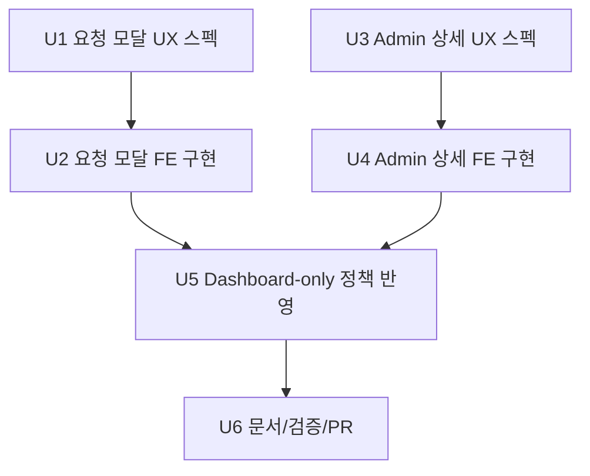

# Confirm Admin/UI-UX Plan + AgentTeam 운영안

## 1) 목표

Confirm migration 이후 남은 UX/운영 공백을 다음 2가지로 정리한다.

1. 승인 요청 시 제외 리소스 사유 입력 UX를 표준화한다.
2. 관리자 승인/확정 액션과 상세 확인을 Admin Dashboard 중심으로 일원화한다.

---

## 2) 정책 확정

1. 관리자 승인/반려/확정 액션은 `Admin Dashboard`에서만 수행한다.
2. `ProjectDetail`은 요청자 관점(선택/요청/진행상태 확인)만 담당한다.
3. 승인 요청 payload는 `confirm.yaml` 단일 계약을 따른다.
   - `input_data.resource_inputs[]`
   - `resource_input.endpoint_config`
   - `resource_input.credential_id`
   - 제외 리소스는 `selected=false`

---

## 3) UI/UX 요구사항

### A. 승인 요청 모달 (요청자 화면)

시점:
- 사용자가 "승인 요청" 버튼 클릭 직후, API 호출 전에 노출

화면 구성:
1. 포함 리소스(`selected=true`) 목록
2. 제외 리소스(`selected=false`) 목록
3. 제외 사유 입력 영역

검증 규칙:
1. 제외 리소스가 1개 이상이면 제외 사유 입력 필수
2. 제외 사유는 기본 사유(`exclusion_reason_default`) + 개별 사유(`exclusion_reason`) 지원
3. 사유 미입력 상태에서는 제출 비활성화

제출 결과:
1. payload를 `input_data.resource_inputs[]` 형식으로 전송
2. 성공 시 요청 생성 완료 토스트 + 최신 상태 갱신
3. 실패 시 에러 코드(`CONFLICT_*`, `VALIDATION_FAILED`) 기반 메시지 노출

### B. Admin 승인요청 상세 UX (Admin Dashboard)

목표:
- 관리자가 요청 상세를 보고 승인/반려를 판단 가능해야 함

화면 구성:
1. 요청 메타: 요청자, 요청시각, requestId
2. 포함 리소스 상세:
   - resource_id, 유형
   - endpoint_config / credential_id 스냅샷
3. 제외 리소스 상세:
   - resource_id
   - exclusion_reason (개별/기본 사유 해석 결과)
4. 액션:
   - 승인
   - 반려(사유 입력)

---

## 4) Task 분해

| ID | Task | 결과물 | Dependency |
|---|---|---|---|
| U1 | 승인요청 모달 UX 스펙 | 필드/검증/에러 문구 정의 | 없음 |
| U2 | 승인요청 모달 FE 구현 | 모달/검증/submit 연결 | U1 |
| U3 | Admin 상세 패널 UX 스펙 | 요청 상세 레이아웃/필수정보 정의 | 없음 |
| U4 | Admin 상세 패널 FE 구현 | 상세 조회/승인/반려 연동 | U3 |
| U5 | Dashboard-only 정책 반영 | ProjectDetail admin 액션 제거 | U2, U4 |
| U6 | 문서/검증/PR | MIGRATION_PLAN 동기화 + test/lint/build | U5 |



---

## 5) AgentTeam 구성 (4역할 고정)

역할은 아래 4개만 사용한다.

1. **Leader (총괄)**
   - 범위 고정, 의사결정, 최종 PR 품질 게이트
   - 코드 직접 구현 금지
2. **UI/UX Specialist**
   - 플로우/검증/에러 상태 설계
   - 와이어/상태 전이 표 작성
3. **Designer**
   - 컴포넌트 구조/카피/인터랙션 디테일 설계
   - 기존 디자인 시스템 토큰 준수
4. **Implementer**
   - 확정된 스펙만 구현
   - 테스트/린트/빌드까지 책임

### 토큰 낭비 방지 규칙

1. 역할별 산출물은 "결정문 + 변경 파일 목록 + 오픈이슈 3개 이하"로 제한
2. 탐색은 필요한 파일만 `rg`로 최소화
3. 동일 이슈 재논의 금지 (Leader 결정 우선)
4. 중간 로그 덤프 금지, diff/결론 중심 보고
5. 1차 구현 후 추가 개선은 별도 후속 Task로 분리

---

## 6) Claude Code용 통합 프롬프트 (AgentTeam 지시문)

```text
최신 main 기준으로 Confirm Admin/UI-UX 후속 작업을 진행해줘.

[팀 구성 - 4역할만 사용]
- Leader: 범위/결정/최종 검수만 담당 (코드 구현 금지)
- UI/UX Specialist: 승인요청 모달 + Admin 상세 UX 플로우/검증 설계
- Designer: UI 구조/문구/상태별 인터랙션 설계
- Implementer: 코드 구현/검증/PR 생성

[정책]
1) 관리자 승인/반려/확정 액션은 Admin Dashboard에서만 수행
2) ProjectDetail에서는 관리자 액션 제거 (요청자 흐름만 유지)
3) Confirm 요청 payload는 docs/swagger/confirm.yaml 단일 계약 준수

[필수 구현]
A. 승인요청 모달
- 승인 요청 전에 모달 오픈
- 포함/제외 리소스 목록 노출
- 제외 리소스가 1개 이상이면 제외 사유 입력 필수
- exclusion_reason_default + exclusion_reason를 payload에 반영

B. Admin Dashboard 상세
- 승인요청 상세 조회 UI 추가
- 포함/제외 리소스 + endpoint_config/credential_id + 제외 사유 표시
- 상세에서 승인/반려 실행 가능

C. Dashboard-only 정리
- ProjectDetail의 admin 액션 UI/호출 경로 제거
- 관리자 mutation 호출은 Dashboard 경로에만 존재하도록 정리

[운영 규칙]
- Worktree-first 준수
- ADR-007 준수
- 요청 범위 외 리팩터링 금지
- 보고 형식: 결정사항 / 변경파일 / 리스크

[검증]
- npm run test:run
- npm run lint
- 필요 시 npm run build

[PR 본문 필수]
1. UX 변경 요약
2. Dashboard-only 정책 반영 내역
3. confirm.yaml 계약 정합성 체크
4. 남은 TODO/리스크
```

