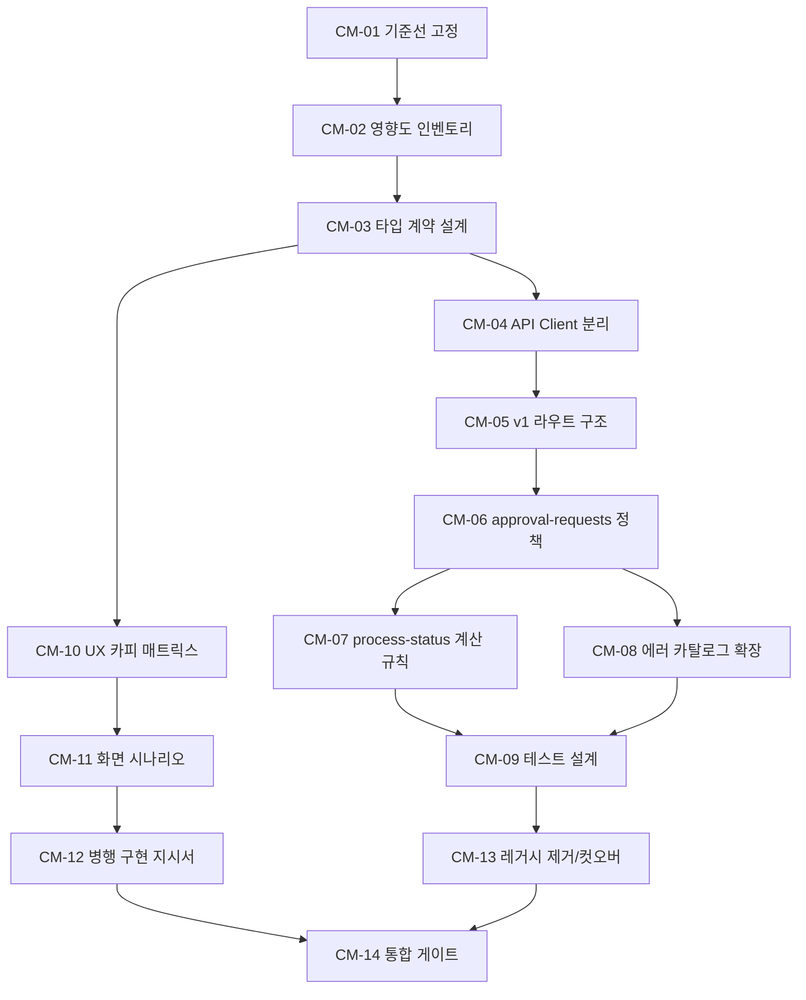

# Confirm Migration Task Plan (Execution Breakdown)

## 1. 최종 결론 (5줄 이내)

- Confirm migration은 `app/api/v1`만 대상으로 진행하며 `/api/projects/**`, `/api/v2/**` 의존은 즉시 차단합니다.
- 스펙 충돌 우선순위는 `docs/swagger/confirm.yaml` > `docs/adr/009-process-status-terminology.md` > `docs/swagger/MIGRATION_PLAN.md` > `docs/adr/006-integration-confirmation-approval-redesign.md`(legacy endpoint 문맥)로 고정합니다.
- `process-status`는 `context` 없이 `status_inputs.last_rejection_reason`를 포함하고, 상태 enum에 `APPLYING_APPROVED`를 반드시 포함합니다.
- `POST /approval-requests`는 `input_data.resource_inputs[]` + `resource_input.endpoint_config` + `resource_input.credential_id`를 표준 입력으로 사용하고 409 코드 2종을 계약으로 고정합니다.
- 실행은 Codex(계약/타입/라우트/mock/테스트/레거시 제거)와 Claude(UX 카피/시나리오/지시서) 병렬 분업으로 진행합니다.

## 2. 전체 작업 목록 표

| TaskID | 작업명 | 설명 | 선행조건 | 산출물 | 난이도(S/M/L) | 예상시간 | Owner | OwnerReason |
|---|---|---|---|---|---|---|---|---|
| CM-01 | 계약 기준선/충돌 매트릭스 고정 | ADR-006/009, confirm.yaml, MIGRATION_PLAN 충돌 지점을 정리하고 우선 소스를 확정한다. | 없음 | 우선순위 표 + 충돌 목록 | S | 30m | Codex | 계약 충돌 식별과 소스 우선순위 확정은 API 정합성 분석 성격이 강함 |
| CM-02 | 코드 영향도/의존성 인벤토리 | `app/api/v1`, `app/lib/api`, `lib/api-client/*`에서 Confirm 관련 호출과 legacy 경로 의존을 추적한다. | CM-01 | 영향도 맵 + 레거시 차단 리스트 | M | 30m | Codex | 대규모 영향 분석과 의존성 추적은 Codex 우선 규칙에 해당함 |
| CM-03 | Confirm v1 타입 계약 설계 | Confirm 전용 request/response 타입을 `confirm.yaml` 기준으로 정의하고 `process-status`에서 `context` 제거, `last_rejection_reason` 포함을 명세화한다. | CM-01 | 타입 설계안(필드/enum/검증 규칙) | M | 1h | Codex | 타입 계약/검증 규칙 수립은 Codex의 계약 정합성 역할과 직결됨 |
| CM-04 | API Client 인터페이스 분리 설계 | `projects` 중심 메서드 의존을 제거하고 `target-sources` 중심 confirm 도메인 인터페이스로 분리한다. | CM-02, CM-03 | API client 인터페이스 변경안 | M | 1h | Codex | 라우트-클라이언트 경계 재설계와 의존성 정리는 Codex 우선 영역임 |
| CM-05 | v1 Confirm 라우트 구조 설계 | `resources`, `approval-requests`, `confirmed-integration`, `approved-integration`, `approval-history`, `process-status` 라우트 구조를 설계한다. | CM-03, CM-04 | 라우트/핸들러 설계서 | M | 1h | Codex | 라우트/핸들러 구조와 ADR-007 준수 여부 판단은 Codex가 적합함 |
| CM-06 | approval-requests 입력/409 정책 설계 | `input_data.resource_inputs[]` 파싱 규칙, `endpoint_config`, `credential_id` 매핑, 409 코드 2종 반환 정책을 상세화한다. | CM-05 | 요청 검증 규칙 + 에러 매핑 표 | M | 1.5h | Codex | 계약 필드/에러코드 검증과 mock/BFF 매핑 설계는 Codex 핵심 책임임 |
| CM-07 | process-status 계산 규칙 설계 | `WAITING_APPROVAL > APPLYING_APPROVED > TARGET_CONFIRMED > REQUEST_REQUIRED` 우선순위와 `status_inputs.last_rejection_reason` 계산 로직을 정의한다. | CM-03, CM-05 | 계산기 명세 + 상태 전이 표 | M | 1h | Codex | 상태 계산은 BFF 계약 정합성 검증과 테스트 설계가 동시에 필요함 |
| CM-08 | 에러 카탈로그/문제응답 확장 설계 | `CONFLICT_APPLYING_IN_PROGRESS`, `CONFLICT_REQUEST_PENDING`을 공통 에러 체계에 반영하는 방안을 확정한다. | CM-06 | 에러 코드 카탈로그 업데이트안 | S | 30m | Codex | API 에러 계약 통합은 타입/라우트/mock 테스트와 강결합된 백엔드 설계 과제임 |
| CM-09 | 테스트 설계 (unit/contract) | route/mapper/calculator/error 변환 테스트 케이스를 설계하고 회귀 체크 범위를 정의한다. | CM-06, CM-07, CM-08 | 테스트 케이스 목록 + 실행 순서 | M | 1h | Codex | 테스트 전략 수립은 라우트/타입/mock 계약 이해가 필요한 Codex 영역임 |
| CM-10 | 상태별 UX 카피 매트릭스 작성 | 상태별 배너/본문/버튼/오류/빈상태 카피를 정리한다. | CM-01, CM-07 | UX 카피 표준 문서 | S | 45m | Claude | 상태별 문구 설계와 사용자 노출 카피 품질은 Claude 우선 영역임 |
| CM-11 | 화면 시나리오/상태 전이 문서화 | 6가지 상태 조합과 화면 전환 시나리오를 단계별로 정리한다. | CM-10 | 시나리오 문서 + 전이 다이어그램 | M | 1h | Claude | 화면 시나리오 표현과 문서 가독화는 Claude가 효율적임 |
| CM-12 | 병행 구현 지시서 작성 | Claude/Codex 병렬 작업에 필요한 구현 지시서(입출력/검증/보고 포맷)를 작성한다. | CM-11 | 병행 구현 브리프 문서 | S | 45m | Claude | 병행 작업 지시서 생산은 Claude의 문서화 강점과 직접 연결됨 |
| CM-13 | 레거시 제거/컷오버 계획 | `/api/projects/**`, `/api/v2/**` 잔존 사용처 제거 순서와 롤백 계획을 작성한다. | CM-02, CM-09 | 제거 체크리스트 + 컷오버 계획 | M | 45m | Codex | 레거시 제거 계획은 의존성 추적/영향 분석이 핵심이라 Codex 우선임 |
| CM-14 | 통합 게이트 점검/릴리즈 준비 | 계약/카피/시나리오/테스트 계획을 합쳐 최종 실행 승인 기준을 만든다. | CM-09, CM-12, CM-13 | 릴리즈 게이트 체크리스트 | S | 30m | Pair | 기술 계약과 UX 산출물을 함께 검토해야 하므로 Pair가 가장 안전함 |

## 3. Dependency



Critical Path: `CM-01 → CM-02 → CM-03 → CM-04 → CM-05 → CM-06 → CM-07 → CM-09 → CM-13 → CM-14`  
이 경로가 지연되면 Confirm migration 구현 착수 자체가 밀립니다.

## 4. 2시간 내 실행 플랜

| 타임박스 | 실행 내용 | 담당 | 완료 기준 |
|---|---|---|---|
| 00:00-00:30 | CM-01 + CM-02 수행 (충돌 우선순위/의존성 인벤토리 확정) | Codex | 충돌 매트릭스와 레거시 차단 리스트가 문서화됨 |
| 00:30-01:00 | CM-03 수행, Claude는 CM-10 초안 시작 | Codex + Claude | Confirm 타입 필드 목록과 상태/입력 제약이 잠김 |
| 01:00-01:30 | CM-04/CM-05 설계안 작성, Claude는 CM-11 전이 시나리오 작성 | Codex + Claude | 라우트 구조와 API client 분리 방향이 합의됨 |
| 01:30-02:00 | CM-06/CM-07 핵심 정책 고정, Claude는 CM-12 병행 지시서 완성 | Codex + Claude | 409 정책/`APPLYING_APPROVED`/`last_rejection_reason`/검증 규칙이 실행 가능 상태로 고정됨 |

## 5. Claude Code에 전달할 프롬프트

### CM-10 프롬프트 (상태별 UX 카피)

```text
너는 Confirm migration UX 카피 담당이다.

[목적]
Confirm 상태별 사용자 노출 문구를 운영 가능한 수준으로 확정한다.

[입력 컨텍스트]
- /Users/study/pii-agent-demo/docs/adr/006-integration-confirmation-approval-redesign.md
- /Users/study/pii-agent-demo/docs/adr/009-process-status-terminology.md
- /Users/study/pii-agent-demo/docs/swagger/confirm.yaml
- /Users/study/pii-agent-demo/docs/swagger/MIGRATION_PLAN.md
- 강제 제약:
  1) Legacy Action 고려 금지 (/api/projects/**, /api/v2/** 의존 금지)
  2) app/api/v1 중심
  3) APPLYING_APPROVED 포함
  4) process-status context 없음
  5) status_inputs.last_rejection_reason 사용
  6) approval-requests 409: CONFLICT_APPLYING_IN_PROGRESS, CONFLICT_REQUEST_PENDING
  7) 승인요청 입력: input_data.resource_inputs[], resource_input.endpoint_config, resource_input.credential_id

[In]
- 기존 UX 카피/배너 문구 (없으면 새로 정의)
- 4개 process_status + 반려/취소/시스템 에러 보조 상태

[Out]
- /Users/study/pii-agent-demo/docs/swagger/CONFIRM_UX_COPY_MATRIX.md
  - 상태별: 제목, 본문, 배너, 버튼 라벨, 토스트, 오류 메시지
  - 409 코드 2종 사용자 메시지 포함

[수용기준(AC)]
1) REQUEST_REQUIRED/WAITING_APPROVAL/APPLYING_APPROVED/TARGET_CONFIRMED 4개 상태 모두 포함
2) APPLYING_APPROVED 문구가 "승인 반영 중" 의미로 일관됨
3) last_rejection_reason 노출 문구가 명시됨
4) /api/projects, /api/v2 표현이 문서에 없음
5) 한국어 문구가 짧고 일관된 톤으로 작성됨

[검증 명령]
rg -n "REQUEST_REQUIRED|WAITING_APPROVAL|APPLYING_APPROVED|TARGET_CONFIRMED|last_rejection_reason|CONFLICT_APPLYING_IN_PROGRESS|CONFLICT_REQUEST_PENDING" /Users/study/pii-agent-demo/docs/swagger/CONFIRM_UX_COPY_MATRIX.md
rg -n "/api/projects|/api/v2" /Users/study/pii-agent-demo/docs/swagger/CONFIRM_UX_COPY_MATRIX.md

[결과 보고 포맷]
Summary:
Changed Files:
Validation:
Open Issues:
```

### CM-11 프롬프트 (화면 시나리오/전이)

```text
너는 Confirm migration 화면 시나리오 문서 담당이다.

[목적]
ADR-006 상태 조합(X/X/X 등)과 ADR-009 process_status를 연결한 화면 전이 시나리오를 작성한다.

[입력 컨텍스트]
- /Users/study/pii-agent-demo/docs/adr/006-integration-confirmation-approval-redesign.md
- /Users/study/pii-agent-demo/docs/adr/009-process-status-terminology.md
- /Users/study/pii-agent-demo/docs/swagger/confirm.yaml
- /Users/study/pii-agent-demo/docs/swagger/MIGRATION_PLAN.md
- 강제 제약:
  1) Legacy Action 고려 금지 (/api/projects/**, /api/v2/** 의존 금지)
  2) app/api/v1 중심
  3) APPLYING_APPROVED 반드시 포함
  4) process-status context 없음
  5) status_inputs.last_rejection_reason 사용

[In]
- 상태 조합 6개(X/X/X, X/O/X, X/X/O, O/X/X, O/O/X, O/X/O)
- process_status 폴링/installation-status 폴링 규칙

[Out]
- /Users/study/pii-agent-demo/docs/swagger/CONFIRM_SCREEN_SCENARIOS.md
  - 상태 전이 표
  - 사용자 액션/시스템 반응/예외(409) 시나리오
  - mermaid 다이어그램 1개 이상

[수용기준(AC)]
1) 6개 상태 조합이 모두 포함됨
2) process-status에 context 필드 언급이 없음
3) APPLYING_APPROVED 상태에서 폴링 규칙이 분리 기재됨
4) 409 코드 2종의 화면 반응이 포함됨
5) 문서가 FE/QA가 그대로 테스트 케이스로 옮길 수 있는 수준임

[검증 명령]
rg -n "X/X/X|X/O/X|X/X/O|O/X/X|O/O/X|O/X/O|APPLYING_APPROVED|CONFLICT_APPLYING_IN_PROGRESS|CONFLICT_REQUEST_PENDING|last_rejection_reason" /Users/study/pii-agent-demo/docs/swagger/CONFIRM_SCREEN_SCENARIOS.md
rg -n "context" /Users/study/pii-agent-demo/docs/swagger/CONFIRM_SCREEN_SCENARIOS.md

[결과 보고 포맷]
Summary:
Changed Files:
Validation:
Open Issues:
```

### CM-12 프롬프트 (병행 구현 지시서)

```text
너는 Confirm migration 병행 구현 지시서 작성 담당이다.

[목적]
Codex(계약/라우트/테스트)와 Claude(UX/시나리오)의 병렬 작업이 충돌 없이 진행되도록 실행 지시서를 만든다.

[입력 컨텍스트]
- /Users/study/pii-agent-demo/docs/swagger/CONFIRM_MIGRATION_TASKS.md
- /Users/study/pii-agent-demo/docs/swagger/CONFIRM_UX_COPY_MATRIX.md (CM-10 결과)
- /Users/study/pii-agent-demo/docs/swagger/CONFIRM_SCREEN_SCENARIOS.md (CM-11 결과)
- 강제 제약:
  1) /api/projects/**, /api/v2/** 금지
  2) app/api/v1 중심
  3) APPLYING_APPROVED 포함
  4) process-status context 없음
  5) status_inputs.last_rejection_reason 사용
  6) approval-requests 입력/409 규칙 고정

[In]
- CM-10/CM-11 산출물
- Confirm API 계약 고정값

[Out]
- /Users/study/pii-agent-demo/docs/swagger/CONFIRM_PARALLEL_EXECUTION_BRIEF.md
  - 병렬 작업 순서
  - 파일 단위 소유권
  - Handoff 입력/완료 기준
  - 리뷰 체크리스트

[수용기준(AC)]
1) 각 작업 단위에 Owner/입력/완료조건이 있음
2) Codex/Claude 병렬 구간과 동기화 포인트가 명시됨
3) 계약 위반 금지 규칙(legacy 금지, context 금지, 409 코드 2종)이 체크리스트로 존재함
4) 검증 명령이 포함됨

[검증 명령]
rg -n "Owner|Handoff|APPLYING_APPROVED|last_rejection_reason|CONFLICT_APPLYING_IN_PROGRESS|CONFLICT_REQUEST_PENDING|/api/v1" /Users/study/pii-agent-demo/docs/swagger/CONFIRM_PARALLEL_EXECUTION_BRIEF.md
rg -n "/api/projects|/api/v2|context" /Users/study/pii-agent-demo/docs/swagger/CONFIRM_PARALLEL_EXECUTION_BRIEF.md

[결과 보고 포맷]
Summary:
Changed Files:
Validation:
Open Issues:
```

## 6. Codex가 직접 맡을 작업 체크리스트

1. CM-01: 기준 문서 충돌 매트릭스 작성  
완료조건: 우선 소스와 충돌 지점(엔드포인트/에러 포맷/히스토리 스키마)이 1페이지로 정리됨.
2. CM-02: 영향도/의존성 인벤토리 작성  
완료조건: Confirm 관련 호출 경로와 legacy 경로 사용처가 파일 단위로 나열됨.
3. CM-03: Confirm v1 타입 계약 확정  
완료조건: `APPLYING_APPROVED`, `status_inputs.last_rejection_reason`, no-`context`가 타입 명세에 반영됨.
4. CM-04: API client 분리 설계 확정  
완료조건: `target-sources` 기반 인터페이스와 mock/bff 매핑표가 준비됨.
5. CM-05: v1 Confirm 라우트 설계 확정  
완료조건: 6개 엔드포인트의 입력/출력/에러/권한 흐름이 문서화됨.
6. CM-06: approval-requests 계약 고정  
완료조건: `input_data.resource_inputs[]`, `endpoint_config`, `credential_id`, 409 코드 2종 정책이 고정됨.
7. CM-07: process-status 계산 규칙 고정  
완료조건: 우선순위 계산식과 `last_rejection_reason` 산출 조건이 테스트 가능한 형태로 정리됨.
8. CM-08: 에러 카탈로그 확장안 작성  
완료조건: 기존 problem 변환 체계에 409 세부 코드 반영 전략이 확정됨.
9. CM-09: 테스트 계획 작성  
완료조건: unit/contract 테스트 케이스와 실행 명령(`npm run test:run`, `npm run lint`)이 문서화됨.
10. CM-13: 레거시 제거/컷오버 계획 작성  
완료조건: 제거 순서, 롤백 경로, 배포 게이트가 체크리스트로 확정됨.

## 7. Handoff Plan

| TaskID | HandoffInput | HandoffDone |
|---|---|---|
| CM-01 | 우선 소스 순위와 충돌 목록(엔드포인트/응답 스키마/에러 포맷) | Codex/Claude가 동일 우선순위를 문서에서 재사용함 |
| CM-02 | 파일 단위 영향도 맵, legacy 사용처 목록 | 후속 Task에서 대상 파일 누락 없이 참조됨 |
| CM-03 | Confirm 타입 필드 정의서, enum/nullable 규칙 | CM-04~CM-09에서 타입 재해석 없이 그대로 사용됨 |
| CM-04 | API client 분리안, mock/bff 메서드 매핑표 | 라우트 설계에서 `/api/v1/target-sources/**`만 참조됨 |
| CM-05 | 6개 엔드포인트 라우트 입출력 설계 | CM-06/CM-07 정책이 라우트 설계에 충돌 없이 추가됨 |
| CM-06 | 승인요청 입력 검증 표, 409 코드 매핑표 | 테스트 계획에서 입력/409 케이스가 모두 포함됨 |
| CM-07 | process-status 계산 우선순위 및 `last_rejection_reason` 규칙 | CM-10/CM-11 문서에서 동일 상태 의미로 표현됨 |
| CM-08 | 에러 카탈로그 확장안, 레거시 코드 매핑안 | CM-09 테스트에서 에러 변환 검증 케이스가 존재함 |
| CM-09 | 테스트 케이스 목록, 실행 명령, 기대 결과 | CM-14 게이트 항목에 테스트 통과 조건이 반영됨 |
| CM-10 | 상태별 UX 카피 표 | CM-11 시나리오 문서의 문구가 카피 표를 참조함 |
| CM-11 | 상태 전이 시나리오와 화면 반응 규칙 | CM-12 구현 지시서가 시나리오를 작업 지시로 변환함 |
| CM-12 | 병행 구현 지시서(Owner, In/Out, 검증) | CM-14에서 실행 게이트로 직접 사용 가능함 |
| CM-13 | 레거시 제거 순서와 컷오버/롤백 체크리스트 | CM-14 릴리즈 승인 기준에 제거 완료 조건이 포함됨 |
| CM-14 | 통합 게이트 체크리스트 초안 | 최종 구현 착수 승인 여부를 단일 문서로 판정 가능함 |

## 8. Decision Needed

1. 에러 응답 포맷 정책 확정 필요  
`confirm.yaml`은 `{ error: { code, message } }` 예시이고, v1 공통은 `application/problem+json`입니다. Confirm 전용도 problem+json으로 통일할지 결정이 필요합니다.
2. `approval-history` 응답 스키마 확정 필요  
ADR-006은 `history[]` 형태, `confirm.yaml`은 `content/page` 페이징 형태입니다. 우선 소스로 `confirm.yaml`을 채택해도 되는지 확정이 필요합니다.
3. `AUTO_APPROVED`의 `last_approval_result` 매핑 정책 필요  
`ApprovalResult.result`에는 `AUTO_APPROVED`가 있으나 `LastApprovalResult` enum에는 없습니다. `APPROVED`로 정규화할지 enum을 확장할지 결정이 필요합니다.
