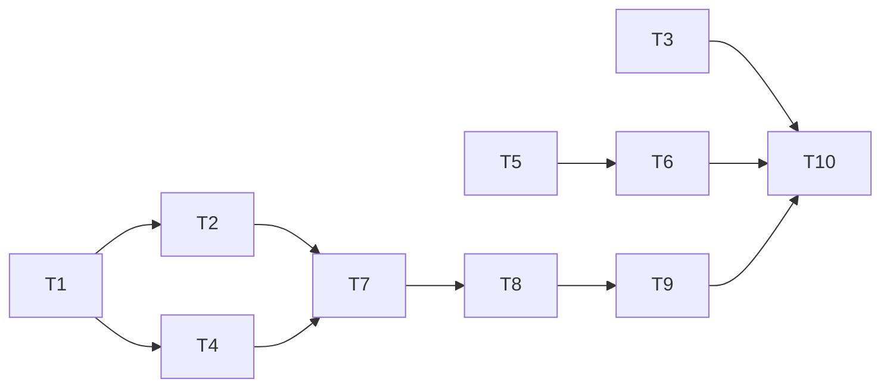

# Swagger Migration Task Board

이 문서는 Swagger migration 실행을 위한 단일 task 관리 보드입니다.

- 기준 문서: `docs/swagger/MIGRATION_PLAN.md`
- 기준 브랜치: `origin/main`
- Last Updated: `2026-02-16`

## 1. 운영 규칙

- 모든 migration 작업은 Task ID(`T1`~) 기준으로 추적합니다.
- 상태 값은 `TODO`, `IN_PROGRESS`, `BLOCKED`, `DONE`만 사용합니다.
- `BLOCKED` Task는 선행 Task가 `DONE` 되기 전에는 시작하지 않습니다.
- Task 완료 기준(Exit Criteria)을 충족하지 못하면 `DONE`으로 변경하지 않습니다.

## 2. Task Backlog

| ID | Phase | Task | Primary Scope | Recommended Owner | Status | Depends On | Exit Criteria |
|---|---|---|---|---|---|---|---|
| T1 | Phase 0 | processStatus 의미 충돌 해소 및 계약 확정 | `confirm.yaml`, `MIGRATION_PLAN.md`, ADR | Claude Code | TODO | - | 상태 용어 충돌 해소 + 401/403/404/409 + "반영 중 신규 요청 차단" 정책 명시 |
| T2 | Phase 0 | PR #146 대체 문서 PR 정리(최신 main 재기반) | `confirm.yaml`, ADR 문서 | Codex | BLOCKED | T1 | PR #146의 충돌/번호/의미 불일치 해소된 문서 PR 생성 |
| T3 | Spec Add | `GET /api/v1/users/search` Swagger 명세 추가 | `user.yaml` | Codex | TODO | - | `/users/search` path + query/response/error 명세 완료 |
| T4 | Phase 0/4 Prep | completion/install + cancel-approval-request 계약 확정 | `confirm.yaml`, `MIGRATION_PLAN.md` | Claude Code | BLOCKED | T1 | endpoint/용어/오류코드 정책 확정 |
| T5 | Phase 2 | Non-Confirm FE callsite 잔여 전환 | `app/lib/api/index.ts`, `app/lib/api/gcp.ts` | Codex | TODO | - | v1 경로 정합화 + gcp `fetchJson` 전환 + Confirm 경로 무변경 |
| T6 | Phase 3 | Non-Confirm legacy route 제거 | `app/api/projects/**`, `app/api/v2/projects/**`(비-Confirm) | Codex | BLOCKED | T5 | 실제 미사용 레거시 제거 + 회귀 검증 통과 |
| T7 | Phase 4 | Confirm v1 API 구현 | `app/api/v1/target-sources/**` (confirm 도메인) | Claude Code | BLOCKED | T2, T4 | approval/confirmed/approved/history/process-status/check/cancel 구현 |
| T8 | Phase 4 | FE Confirm 흐름 전환 | confirm 관련 FE callsite/UI | Claude Code | BLOCKED | T7 | Confirm FE가 v1 계약만 사용 |
| T9 | Phase 3/4 | Confirm legacy 제거 + 최종 문서 정리 | legacy confirm routes + docs | Codex | BLOCKED | T8 | 구 경로 제거 + 최종 API 인벤토리 반영 |
| T10 | Final Gate | 통합 검증 및 배포 준비 | lint/test/build + 문서 동기화 | Codex | BLOCKED | T3, T6, T9 | `npm run lint`, `npm run test:run`, `npm run build` 통과 |

## 3. Dependency Graph

## 4. 2-Hour Sprint 운영안

- 병렬 실행 후보: `T1` + `T3` + `T5`
- Sprint 종료 조건:
  - `T1` 결정사항이 문서에 반영되어 `T2/T4/T7` 착수 기준 제공
  - `T3`, `T5` 구현/문서가 main 기준 충돌 없이 PR 가능한 상태
- 통합 게이트:
  - Task 간 계약 충돌 여부 확인 (`T1` vs `T5`)
  - 최소 검증: `npm run lint`, `npm run test:run`

## 5. PR Tracking

- 기준 반영 PR(merge 완료): `#157`
- 참조 PR(미반영/충돌 상태): `#146` (`CONFLICTING`)
- 후속 원칙:
  - `#146` 직접 merge 대신, `T1` 결정 반영 후 대체 PR로 정리
  - 구현 PR은 Task ID를 제목/본문에 명시

## 6. 변경 관리 체크리스트

- [ ] Task 상태 업데이트 (`TODO`/`IN_PROGRESS`/`BLOCKED`/`DONE`)
- [ ] 선행 Task 충족 여부 확인
- [ ] Task별 Exit Criteria 확인
- [ ] PR 본문에 Task ID 및 의존성 링크 포함
