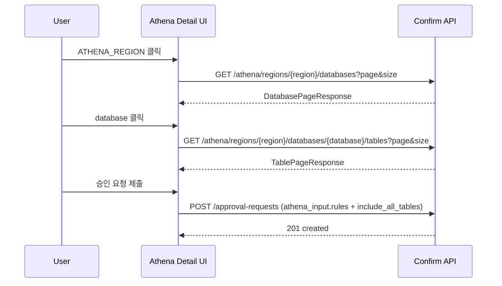

# PII Agent 연동 관리 — 유저 스토리 & Flow 정의

> **범위**: AWS / Azure / GCP 공통 프로세스 + Athena Region 기반 확장 (IDC, SDU는 추후 별도 문서)
> **기준**: 2026-03-02 main + Athena 확장 설계 반영 상태

---

## 1. 프로세스 상태 개요

7단계 프로세스 상태 (`ProcessStatus` enum):

| Step | 상태명 | 한글명 |
|------|--------|--------|
| 1 | WAITING_TARGET_CONFIRMATION | 연동 대상 확정 |
| 2 | WAITING_APPROVAL | 승인 대기 |
| 3 | APPLYING_APPROVED | 연동대상반영중 |
| 4 | INSTALLING | 설치 진행 |
| 5 | WAITING_CONNECTION_TEST | 연결 테스트 |
| 6 | CONNECTION_VERIFIED | 연결 확인 |
| 7 | INSTALLATION_COMPLETE | 완료 |

### 상태 계산 로직 (AWS/Azure/GCP)

```
targets.confirmed === false           → Step 1
approval.status ∈ {PENDING, REJECTED} → Step 2
installation.status === 'PENDING'     → Step 3
installation.status !== 'COMPLETED'   → Step 4
!connectionTest.passedAt              → Step 5
!connectionTest.operationConfirmed    → Step 6
else                                  → Step 7
```

> **주의**: 반려(REJECTED)는 Step 2에 머묾. Step 1로 자동 전이하지 않음.

---

## 2. 유저 스토리

### US-001: Scan 수행

**As a** 사용자,
**I want to** 현재 시스템의 리소스를 Scan하고 싶다,
**So that** 연동 가능한 리소스 목록을 최신 상태로 파악할 수 있다.

**AC:**
- [AC1] [Scan 시작] 버튼을 클릭하면 Scan이 시작된다
  - API: `POST /api/v1/target-sources/{id}/scan`
- [AC2] Scan 진행 중에는 진행 상태(진행중/완료/실패)와 진행률을 확인할 수 있다
  - API: `GET /api/v1/target-sources/{id}/scanJob/latest` (polling)
- [AC3] Scan이 이미 진행 중이면 [Scan 시작] 버튼이 비활성화되어 중복 Scan을 방지한다
- [AC4] 마지막 Scan 완료 시각을 확인할 수 있다
- [AC5] Scan 이력을 조회할 수 있다
  - API: `GET /api/v1/target-sources/{id}/scan/history`

**노출 조건**: Step 1, Step 7에서 ScanPanel이 노출됨. Step 2~6에서는 미노출.

---

### US-002: 연동 대상 리소스 목록 조회

**As a** 사용자,
**I want to** 최신 Scan 결과를 기반으로 연동 가능한 리소스 목록을 보고 싶다,
**So that** 어떤 리소스를 연동할지 선택할 수 있다.

**AC:**
- [AC1] Scan이 완료되면 리소스 목록이 ResourceTable에 표시된다
  - API: `GET /api/v1/target-sources/{id}` (프로젝트 조회 시 resources 포함)
- [AC2] 각 리소스의 이름, 유형(resourceType), DB 유형(databaseType), 연결 상태(connectionStatus)를 확인할 수 있다
- [AC3] 리소스는 integrationCategory로 분류된다:
  - `TARGET`: 연동 대상 (체크박스 선택 가능)
  - `NO_INSTALL_NEEDED`: 설치 불필요 (선택 가능, 자동승인에 영향 없음)
  - `INSTALL_INELIGIBLE`: 연동 불가 (선택 불가)
- [AC4] 리소스가 0건이면 빈 상태 안내가 표시된다
- [AC5] AWS의 경우 리전별/리소스타입별 그룹핑, Azure/GCP는 리소스타입별 그룹핑으로 표시된다
- [AC6] Athena는 일반 `ATHENA` 리소스가 아닌 `ATHENA_REGION` 리소스로 노출된다
  - `metadata.athena_region` 필드로 Region 코드를 제공한다
- [AC7] Scan 결과가 Athena Table 단위로 매우 많아도, 기본 목록은 Region 단위 리소스로 축약되어 노출된다

---

### US-003: 연동 대상 선택 및 입력값 설정

**As a** 사용자,
**I want to** 연동할 리소스를 개별 선택하고, 각 리소스에 필요한 설정값을 입력하고 싶다,
**So that** 연동에 필요한 정보를 빠짐없이 준비할 수 있다.

**AC:**
- [AC1] 리소스를 개별적으로 체크박스로 선택/해제할 수 있다 (Step 1 또는 편집 모드)
- [AC2] DB Credential을 각 리소스에 할당할 수 있다
  - API: `PATCH /api/v1/target-sources/{id}/resources/credential`
- [AC3] VM 리소스(EC2, Azure VM)의 경우 데이터베이스 설정 패널이 제공된다:
  - DB 유형, 포트, 호스트(EC2), NIC 선택(Azure VM), Oracle ServiceId
- [AC4] VM 리소스가 선택되었으나 DB 설정이 없으면 [연동 대상 확정 승인 요청] 버튼 클릭 시 경고가 표시된다
- [AC5] 선택한 리소스가 0건이면 [연동 대상 확정 승인 요청] 버튼이 비활성화된다
- [AC6] Athena Region 리소스 클릭 시 Database 목록을 페이지네이션으로 조회할 수 있다
  - API: `GET /api/v1/target-sources/{id}/athena/regions/{region}/databases?page={n}&size={m}`
- [AC7] Athena Database 클릭 시 Table 목록을 페이지네이션으로 조회할 수 있다
  - API: `GET /api/v1/target-sources/{id}/athena/regions/{region}/databases/{database}/tables?page={n}&size={m}`
- [AC8] Athena 선택 UI는 Region/Database/Table 모두 기본 체크박스 형태로 표현된다 (선택=체크, 제외=미체크)
- [AC9] `include_all_tables`는 Region/Database 레벨에서만 별도 체크박스로 노출되며, 해당 노드가 선택된 경우에만 표시된다
- [AC10] Database/Table 조회 중에는 로딩 Spinner가 표시되고, 탐색 API는 사용자가 펼칠 때만 호출된다 (lazy load)

> **참고**: 프론트엔드 로컬 상태 관리. 리소스 선택 자체는 API 호출 없음 (Credential 할당만 API 호출).

---

### US-004: 연동 대상 승인 요청

**As a** 사용자,
**I want to** 선택한 연동 대상 리소스에 대해 승인을 요청하고 싶다,
**So that** 관리자 승인을 거쳐 실제 연동이 진행될 수 있다.

**AC:**
- [AC1] [연동 대상 확정 승인 요청] 클릭 시 ApprovalRequestModal이 표시되어 연동/제외 대상을 최종 확인할 수 있다
- [AC2] 모달에서 제외 사유 기본값을 입력할 수 있다
- [AC3] 승인 요청 시 연동 대상 + 각 리소스별 입력값(credential_id, endpoint_config) + 제외 사유가 서버에 전송된다
  - API: `POST /api/v1/target-sources/{id}/approval-requests`
- [AC4] 요청 성공 시 프로젝트 상태가 갱신되어 Step 2(승인대기)로 전이된다
- [AC5] 요청 실패 시 모달 내에 에러 메시지가 표시된다
- [AC6] **자동 승인**: 선택하지 않은 리소스가 모두 기 제외(exclusion) 상태인 경우, 자동 승인되어 Step 3으로 즉시 전이된다
- [AC7] Athena 선택 입력은 `input_data.athena_input.rules[]`로 전송한다
  - `resource_id`는 기존 ID 포맷(`athena:{aws_account_id}/region[/database[/table]]`)을 그대로 사용한다
  - `include_all_tables` 필드는 POST requestBody에서만 사용한다
- [AC8] Athena Table 개별 선택이 과도한 경우(예: 70,000개), Region/Database scope + `include_all_tables=true` 방식으로 요청을 유도한다

---

### US-005: 승인 요청 내역 조회

**As a** 사용자,
**I want to** 내가 요청한 승인 내역과 현재 상태를 확인하고 싶다,
**So that** 승인이 어떻게 진행되고 있는지 파악할 수 있다.

**AC:**
- [AC1] Step 2에서 [요청 내용 확인] 버튼으로 최신 승인 요청 상세를 모달로 확인할 수 있다
  - API: `GET /api/v1/target-sources/{id}/approval-history?page=0&size=1`
- [AC2] Step 3에서 [승인 내역 확인] 버튼으로 승인된 요청 내용을 확인할 수 있다
- [AC3] 기존 확정 연동 정보가 있는 경우 "현재 연동 정보 보기" 접이식 영역이 표시된다
  - API: `GET /api/v1/target-sources/{id}/confirmed-integration`
- [AC4] 승인 이력을 페이지네이션으로 조회할 수 있다 (진행 내역 탭)
  - API: `GET /api/v1/target-sources/{id}/approval-history?page={n}&size=10`
- [AC5] approval-request/history/confirmed/approved 응답에는 Athena Region 요약(`athena_region_resources`)이 기본 포함된다
- [AC6] Athena Database/Table 상세는 필요 시점에만 전용 하위 endpoint로 페이지네이션 조회한다

---

### US-006: 승인 요청 취소

**As a** 사용자,
**I want to** 승인대기 상태의 요청을 취소하고 싶다,
**So that** 잘못 요청한 경우 되돌릴 수 있다.

**AC:**
- [AC1] Step 2(승인대기)에서 [요청 취소] 버튼이 노출된다 (ApprovalWaitingCard 내)
- [AC2] 클릭 시 CancelApprovalModal 확인 다이얼로그가 표시된다
- [AC3] 취소 성공 시 Step 1(연동 대상 확정)로 전이된다
  - API: `POST /api/v1/target-sources/{id}/approval-requests/cancel`
- [AC4] 이미 승인/반려 처리된 경우 에러가 표시된다

---

### US-007: 연동 대상 수정 (재요청)

**As a** 사용자,
**I want to** 이전 연동 완료 이후에도 연동 대상을 수정하고 싶다,
**So that** 변경된 리소스를 반영할 수 있다.

**AC:**
- [AC1] 비처리중(non-processing) 상태에서 [확정 대상 수정] 버튼이 제공된다
  - 비처리중 = Step 2(승인대기), Step 3(반영중), Step 4(설치진행)가 **아닌** 상태
  - 즉, Step 1, Step 5, Step 6, Step 7에서 노출
- [AC2] 클릭 시 편집 모드로 전환되어 리소스 선택/해제가 가능해진다
- [AC3] 편집 모드에서 [취소] 버튼으로 편집을 취소할 수 있다 (Step 1에서는 미노출)
- [AC4] 편집 완료 후 [연동 대상 확정 승인 요청]으로 신규 승인 요청을 생성한다

---

### US-008: 연동 변경 내역 비교 조회

**As a** 사용자,
**I want to** 이전 연동 확정 내역과 신규 연동 내역의 변경 사항을 비교하여 확인하고 싶다,
**So that** 기존 연동이 어떻게 변경되는지 한눈에 파악할 수 있다.

**AC:**
- [AC1] Step 3(연동대상반영중)에서 ResourceTransitionPanel이 Cloud 리소스 영역을 대체하여 표시된다
- [AC2] 기존 확정 연동 리소스(이전)와 신규 연동 리소스(변경 후)가 상하로 배치되어 비교 가능하다
  - API: `GET /api/v1/target-sources/{id}/confirmed-integration` (이전 내역)
- [AC3] 기존 확정 리소스는 반투명(opacity 50%)으로 표시되고, "반영 중" 화살표로 전환 방향을 나타낸다
- [AC4] 이전 확정 내역이 없는 경우(최초 연동) 신규 리소스만 "연동 대상 리소스"로 표시된다
- [AC5] 리소스 수가 각각 표기된다 (예: "기존 연동 리소스 (3개)" → "신규 연동 리소스 (5개)")

---

### US-009: 설치 상태 조회

**As a** 사용자,
**I want to** 각 리소스별 설치 진행 상태를 확인하고 싶다,
**So that** 설치가 정상적으로 진행되고 있는지 파악할 수 있다.

**AC:**
- [AC1] Step 4(설치 진행)에서 Provider별 설치 상태 컴포넌트가 표시된다
  - AWS: AwsInstallationInline — 진행률 표시, Script/Role 상태
  - Azure: AzureInstallationInline — BDC 상태, PE 승인 가이드
  - GCP: GcpInstallationInline — PSC 지원, 리전별 프록시
- [AC2] 설치 상태는 폴링(10초)으로 자동 갱신된다
  - API: `GET /api/v1/{provider}/target-sources/{id}/installation-status`
  - API (공통): `GET /api/v1/target-sources/{id}/process-status` (상태 전이 감지)
- [AC3] 설치 완료 시 자동으로 Step 5로 전이된다 (폴링 감지)

---

### US-010: Terraform Script 다운로드

**As a** 사용자,
**I want to** Terraform Script를 다운로드하고 싶다,
**So that** 수동으로 설치를 진행할 수 있다.

**AC:**
- [AC1] AWS 수동설치 모드(MANUAL)에서 다운로드 버튼이 제공된다
  - API: `GET /api/v1/aws/target-sources/{id}/terraform-script`
- [AC2] Azure VM 리소스가 포함된 경우 VM TF Script 다운로드 버튼이 제공된다
  - API: `GET /api/v1/azure/target-sources/{id}/vm-terraform-script`
- [AC3] AWS 자동설치 모드(AUTO)에서는 다운로드 버튼이 미노출된다

---

### US-011: 연결 테스트 수행

**As a** 사용자,
**I want to** 연동된 리소스에 대해 연결 테스트를 수행하고 싶다,
**So that** 실제로 연결이 정상 동작하는지 검증할 수 있다.

**AC:**
- [AC1] Step 5(연결 테스트)에서 ConnectionTestPanel이 표시된다
- [AC2] [연결 테스트 수행] 버튼으로 비동기 테스트를 시작할 수 있다
  - API: `POST /api/v1/target-sources/{id}/test-connection`
- [AC3] DB Credential 미설정 리소스가 존재하면 CredentialSetupModal이 먼저 표시된다
  - API (조회): `GET /api/v1/target-sources/{id}/secrets`
  - API (설정): `PATCH /api/v1/target-sources/{id}/resources/credential`
- [AC4] 마지막 테스트가 실패한 상태에서 재시도 시 Credential 확인 모달이 review 모드로 표시된다
- [AC5] 테스트 진행 중에는 진행률 바가 표시되고 버튼이 비활성화된다
  - API (polling): `GET /api/v1/target-sources/{id}/test-connection/latest`
- [AC6] 완료 시 결과 요약(성공/실패 건수)이 표시되고, [상세 보기]로 리소스별 결과를 확인할 수 있다
- [AC7] 테스트 성공 시 Step 6(연결 확인)으로 자동 전이된다
- [AC8] 테스트 실패 시 실패 사유(error_status)와 가이드가 표시되고 재시도할 수 있다
- [AC9] [전체 내역] 링크로 테스트 이력을 페이지네이션으로 조회할 수 있다
  - API: `GET /api/v1/target-sources/{id}/test-connection/results?page={n}&size=5`

---

### US-012: 연결 완료 리소스 상태 조회

**As a** 사용자,
**I want to** 연동된 리소스의 논리 DB 목록과 연결 상태를 확인하고 싶다,
**So that** 연동된 리소스가 정상적으로 운영되고 있는지 모니터링할 수 있다.

**AC:**
- [AC1] Step 6(연결 확인), Step 7(완료)에서 LogicalDbStatusPanel이 표시된다
- [AC2] 각 리소스별 논리 DB 수, 성공/실패/대기 건수를 확인할 수 있다
  - API: `GET /api/v1/target-sources/{id}/logical-db-status`
- [AC3] 시각적 진행률 바(성공=녹색, 실패=빨강, 대기=회색)로 전체 현황을 한눈에 파악할 수 있다
- [AC4] PII Agent 비정상 시 경고 배너가 표시된다 (`agent_running === false`)
- [AC5] 조회 실패 시 에러 메시지와 [다시 시도] 버튼이 제공된다
- [AC6] Step 6/7에서 ConnectionTestPanel과 LogicalDbStatusPanel이 2열 그리드로 나란히 표시된다

---

### US-013: Athena 스냅샷 기준 상세 조회

**As a** 사용자,
**I want to** Athena 정보를 Region 요약으로 빠르게 보고, 필요 시 Database/Table 상세를 펼쳐서 보고 싶다,
**So that** 대량 Athena 환경에서도 화면 응답성을 유지하면서 필요한 수준까지 확인할 수 있다.

**AC:**
- [AC1] 기본 조회 응답(`approval-request`, `approval-history`, `confirmed-integration`, `approved-integration`)에는 `athena_region_resources`가 포함된다
- [AC2] 승인요청 상세 모달에서 Region 클릭 시 해당 request 스냅샷 기준 Database 목록을 조회한다
  - 조회 결과는 요청 시점에 확정된 "선택된 Table" 기준으로만 구성된다
  - API: `GET /api/v1/target-sources/{id}/approval-requests/{requestId}/athena/regions/{region}/databases?page={n}&size={m}`
- [AC3] 승인요청 상세 모달에서 Database 클릭 시 해당 request 스냅샷 기준 Table 목록을 조회한다
  - 미선택/제외 Table은 반환하지 않는다
  - API: `GET /api/v1/target-sources/{id}/approval-requests/{requestId}/athena/regions/{region}/databases/{database}/tables?page={n}&size={m}`
- [AC4] 승인 이력 탭에서 Region/Database 상세 조회 시 historyId 기준 resolved snapshot을 사용한다
  - 조회 결과는 해당 이력의 선택된 Table snapshot만 포함한다
  - API: `GET /api/v1/target-sources/{id}/approval-history/{historyId}/athena/regions/{region}/databases?page={n}&size={m}`
  - API: `GET /api/v1/target-sources/{id}/approval-history/{historyId}/athena/regions/{region}/databases/{database}/tables?page={n}&size={m}`
- [AC5] 현재 확정/반영중 정보에서도 Region/Database 상세 조회를 각각 지원한다
  - 두 조회 모두 선택된 Table만 반환한다
  - API: `GET /api/v1/target-sources/{id}/confirmed-integration/athena/regions/{region}/databases?page={n}&size={m}`
  - API: `GET /api/v1/target-sources/{id}/confirmed-integration/athena/regions/{region}/databases/{database}/tables?page={n}&size={m}`
  - API: `GET /api/v1/target-sources/{id}/approved-integration/athena/regions/{region}/databases?page={n}&size={m}`
  - API: `GET /api/v1/target-sources/{id}/approved-integration/athena/regions/{region}/databases/{database}/tables?page={n}&size={m}`
- [AC6] 모든 Athena 상세 조회는 Pagination + Spinner를 제공한다
- [AC7] 승인요청 상세(요청 내용 확인)에서도 동일한 Region > Database > Table drill-down을 제공한다 (읽기 전용 체크박스 트리)
- [AC8] 미선택(제외) 상태의 Region/Database/Table에는 `include_all_tables`를 표시하지 않는다

---

### Admin-001: 승인 요청 목록 조회

**As a** 관리자,
**I want to** 사용자들이 요청한 승인 건을 확인하고 싶다,
**So that** 대기 중인 요청을 확인하고 처리할 수 있다.

**AC:**
- [AC1] AdminDashboard의 ProjectsTable에서 프로젝트별 승인 상태(processStatus)를 확인할 수 있다
- [AC2] 승인대기(WAITING_APPROVAL) 상태의 프로젝트 행에 [승인 상세] 액션이 제공된다
- [AC3] 클릭 시 ApprovalDetailModal이 표시되어 요청자, 요청일시, 포함/제외 리소스 목록을 확인할 수 있다
  - API: `GET /api/v1/target-sources/{id}/approval-history?page=0&size=1`

---

### Admin-002: 승인 요청 승인/반려

**As a** 관리자,
**I want to** 승인 요청을 승인하거나 반려하고 싶다,
**So that** 적절한 연동 대상만 실제 반영되도록 통제할 수 있다.

**AC:**
- [AC1] ApprovalDetailModal에서 [승인] 버튼 클릭 시 승인이 처리된다
  - API: `POST /api/v1/target-sources/{id}/approval-requests/approve`
- [AC2] 승인 완료 시 프로젝트 상태가 Step 3(연동대상반영중)으로 전이된다
- [AC3] [반려] 버튼 클릭 시 반려 사유 입력 폼이 표시된다
- [AC4] 반려 사유는 필수 입력이며, 비어있으면 [반려하기] 버튼이 비활성화된다
  - API: `POST /api/v1/target-sources/{id}/approval-requests/reject`
- [AC5] 반려 완료 시 사용자에게 반려 사유가 RejectionAlert로 표시된다 (Step 2에서)
- [AC6] 이미 승인/반려 처리된 상태에서는 승인/반려 버튼이 미노출되고 [닫기]만 표시된다

---

## 3. Flow 정의

### 공통 레이아웃 (모든 State)

```
┌──────────────────────────────────────────────────────────┐
│ ProjectHeader (프로젝트명, 서비스코드, Provider)            │
├─────────────┬────────────────────────────────────────────┤
│ Sidebar     │  Main Content                              │
│ ├ InfoCard  │  ├ ProcessStatusCard (프로세스 바 + 액션)    │
│ └ ProjectInfo│ ├ Cloud 리소스 (Scan + ResourceTable)      │
│             │  ├ RejectionAlert (반려 시)                  │
│             │  └ 하단 버튼 (확정/수정/취소)                 │
└─────────────┴────────────────────────────────────────────┘
```

### 공통 API (모든 State 진입 시)

- `GET /api/v1/target-sources/{id}` — 프로젝트 전체 조회 (resources, status 포함)
- `GET /api/v1/target-sources/{id}/process-status` — BFF 프로세스 상태 조회 (폴링 시)

---

### Athena 공통 Drill-down Flow (Step 1/2/3 + 상세 모달)

```
[ResourceTable/상세모달]
    │
    ├─ ATHENA_REGION row 기본 노출 (resource_id + metadata.athena_region)
    │
    ├─ Region 클릭
    │    └─ GET .../athena/regions/{region}/databases?page&size
    │          → Database 페이지 렌더 + Spinner 종료
    │
    ├─ Database 클릭
    │    └─ GET .../athena/regions/{region}/databases/{database}/tables?page&size
    │          → Table 페이지 렌더 + Spinner 종료
    │
    └─ [승인 요청]
         └─ POST .../approval-requests
              input_data.athena_input.rules[] 전달
              (대량 시 include_all_tables=true 권장)
```

**컨텍스트별 Athena 상세 조회 기준:**
- Step 1(리소스 선택): 현재 스캔 기준 `GET /athena/regions/{region}/databases`, `.../tables`
- Step 2 요청 상세: `approval-requests/{requestId}/athena/**` (요청 시점 resolved snapshot)
- Step 2 이력 탭: `approval-history/{historyId}/athena/**` (요청 시점 resolved snapshot)
- Step 3/현재 연동정보: `confirmed-integration/athena/**` 또는 `approved-integration/athena/**`

---

### State 1: 연동 대상 확정 (WAITING_TARGET_CONFIRMATION)

**관련 US**: US-001, US-002, US-003, US-004, US-013

#### 프로세스 바

```
[연동 대상 확정(●)] → [승인 대기] → [반영중] → [설치] → [테스트] → [확인] → [완료]
```

#### ProcessStatusCard 영역

- 가이드 안내 박스: Provider별 수행 절차 안내 텍스트

#### Cloud 리소스 영역

| 컴포넌트 | 설명 |
|---------|------|
| ScanPanel | Scan 시작, 진행 상태, 이력 조회 |
| ResourceTable | 리소스 체크박스 선택, Credential 할당, VM 설정, ATHENA_REGION Drill-down 진입 |

#### 사용자 액션

| 액션 | API | 결과 |
|------|-----|------|
| Scan 시작 | `POST .../scan` | ScanPanel에서 polling 시작 |
| Credential 할당 | `PATCH .../resources/credential` | 즉시 반영 |
| Athena Region 펼치기 | `GET .../athena/regions/{region}/databases` | DB 목록 pagination 조회 |
| Athena Database 펼치기 | `GET .../athena/regions/{region}/databases/{database}/tables` | Table 목록 pagination 조회 |
| [연동 대상 확정 승인 요청] | (로컬) | ApprovalRequestModal 표시 |
| 모달에서 [요청] | `POST .../approval-requests` | 성공 → Step 2 전이 |

#### AWS 특수사항

- 설치 모드(AUTO/MANUAL) 미선택 시 AwsInstallationModeSelector가 먼저 표시됨
- `GET /api/v1/aws/target-sources/{id}/installation-status` — 설치 상태 초기 로드
- `GET /api/v1/aws/target-sources/{id}/settings` — AWS 설정(Region, 설치모드 등)

---

### State 2: 승인 대기 (WAITING_APPROVAL)

**관련 US**: US-005, US-006, US-013

#### 프로세스 바

```
[연동 대상 확정(✓)] → [승인 대기(●)] → [반영중] → [설치] → [테스트] → [확인] → [완료]
```

#### ProcessStatusCard 영역

**반려되지 않은 경우 (`!project.isRejected`):**
- ApprovalWaitingCard
  - "관리자 승인을 기다리고 있습니다"
  - [요청 내용 확인] → ApprovalRequestDetailModal
  - [요청 취소] → CancelApprovalModal
  - 기존 확정 연동이 있으면 ConfirmedIntegrationCollapse

**반려된 경우 (`project.isRejected`):**
- ApprovalWaitingCard 미노출
- RejectionAlert 표시 (반려 사유, 반려일시, [리소스 다시 선택하기] 버튼)

#### Cloud 리소스 영역

- ScanPanel + ResourceTable (읽기 모드)
- 반려 시 [리소스 다시 선택하기] → 편집 모드 전환

#### 폴링

- 10초 간격으로 `GET .../process-status` 조회
- 상태 변화 감지 시 프로젝트 재조회 → Step 3 자동 전이

#### 사용자 액션

| 액션 | API | 결과 |
|------|-----|------|
| 요청 내용 확인 | `GET .../approval-history?page=0&size=1` | 모달 표시 |
| 요청 상세의 Athena Region 펼치기 | `GET .../approval-requests/{requestId}/athena/regions/{region}/databases` | DB 목록 pagination 조회 |
| 요청 상세의 Athena Database 펼치기 | `GET .../approval-requests/{requestId}/athena/regions/{region}/databases/{database}/tables` | Table 목록 pagination 조회 |
| 이력 항목의 Athena Region 펼치기 | `GET .../approval-history/{historyId}/athena/regions/{region}/databases` | DB 목록 pagination 조회 |
| 이력 항목의 Athena Database 펼치기 | `GET .../approval-history/{historyId}/athena/regions/{region}/databases/{database}/tables` | Table 목록 pagination 조회 |
| 요청 취소 | `POST .../approval-requests/cancel` | 성공 → Step 1 전이 |
| 리소스 다시 선택 (반려 시) | (로컬) | 편집 모드 전환 |

---

### State 3: 연동대상반영중 (APPLYING_APPROVED)

**관련 US**: US-005, US-008, US-013

#### 프로세스 바

```
[연동 대상 확정(✓)] → [승인 대기(✓)] → [반영중(●)] → [설치] → [테스트] → [확인] → [완료]
```

#### ProcessStatusCard 영역

- ApprovalApplyingBanner
  - "승인이 완료되어 연동을 반영하고 있습니다"
  - 기존 확정 있음: "기존 연동 대상이 신규 연동 대상으로 전환됩니다. 반영은 최대 하루 소요될 수 있습니다."
  - 기존 확정 없음: "반영은 최대 하루 소요될 수 있습니다. 완료 시 알림을 보내드립니다."
  - [승인 내역 확인] 버튼
  - 기존 확정 있으면 ConfirmedIntegrationCollapse

#### Cloud 리소스 영역

- **ResourceTransitionPanel**이 일반 ScanPanel + ResourceTable을 **대체**
  - 기존 확정 리소스 (반투명) + "반영 중" 화살표 + 신규 연동 리소스
  - API: `GET .../confirmed-integration` (이전 확정 내역)

#### 폴링

- 10초 간격으로 process-status 조회
- 상태 변화 감지 → Step 4 자동 전이

#### 사용자 액션

- 없음 (읽기 전용)
- Athena Region/Database 상세 조회(읽기):
  - `GET .../confirmed-integration/athena/regions/{region}/databases`
  - `GET .../confirmed-integration/athena/regions/{region}/databases/{database}/tables`
  - `GET .../approved-integration/athena/regions/{region}/databases`
  - `GET .../approved-integration/athena/regions/{region}/databases/{database}/tables`

---

### State 4: 설치 진행 (INSTALLING)

**관련 US**: US-009, US-010

#### 프로세스 바

```
[연동 대상 확정(✓)] → [승인 대기(✓)] → [반영중(✓)] → [설치(●)] → [테스트] → [확인] → [완료]
```

#### ProcessStatusCard 영역

Provider별 InlineInstallation 컴포넌트:

| Provider | 컴포넌트 | API |
|----------|---------|-----|
| AWS | AwsInstallationInline | `GET /api/v1/aws/target-sources/{id}/installation-status` |
| Azure | AzureInstallationInline | `GET /api/v1/azure/target-sources/{id}/installation-status` |
| GCP | GcpInstallationInline | `GET /api/v1/gcp/target-sources/{id}/installation-status` |

- 설치 완료 시 폴링 감지 → Step 5 자동 전이

#### Cloud 리소스 영역

- ScanPanel + ResourceTable (읽기 모드)

#### 폴링

- 10초 간격으로 process-status 조회 (ProcessStatusCard)
- Provider별 installation-status 주기적 조회 (각 InlineInstallation)

#### 사용자 액션

| 액션 | 조건 | API |
|------|------|-----|
| TF Script 다운로드 | AWS MANUAL 모드 | `GET /api/v1/aws/target-sources/{id}/terraform-script` |
| VM TF Script 다운로드 | Azure VM 포함 | `GET /api/v1/azure/target-sources/{id}/vm-terraform-script` |

---

### State 5: 연결 테스트 (WAITING_CONNECTION_TEST)

**관련 US**: US-011

#### 프로세스 바

```
[연동 대상 확정(✓)] → [승인 대기(✓)] → [반영중(✓)] → [설치(✓)] → [테스트(●)] → [확인] → [완료]
```

#### ProcessStatusCard 영역

- ConnectionTestPanel
  - 가이드 안내 (3단계)
  - [연결 테스트 수행] 버튼
  - 진행 중 시 진행률 바
  - 완료 시 결과 요약 + [상세 보기]
  - [전체 내역] 링크 → TestConnectionHistoryModal

#### Cloud 리소스 영역

- ScanPanel + ResourceTable (읽기 모드)

#### 사용자 액션

| 액션 | API | 결과 |
|------|-----|------|
| 연결 테스트 수행 | `POST .../test-connection` | polling 시작 |
| (Credential 미설정 시) 설정 | `GET .../secrets` + `PATCH .../resources/credential` | CredentialSetupModal |
| polling | `GET .../test-connection/latest` | 4초 간격 |
| 전체 내역 조회 | `GET .../test-connection/results` | TestConnectionHistoryModal |

---

### State 6: 연결 확인 (CONNECTION_VERIFIED)

**관련 US**: US-011, US-012

#### 프로세스 바

```
[연동 대상 확정(✓)] → [승인 대기(✓)] → [반영중(✓)] → [설치(✓)] → [테스트(✓)] → [확인(●)] → [완료]
```

#### ProcessStatusCard 영역

- **2열 그리드**:
  - 좌: ConnectionTestPanel (재테스트 가능)
  - 우: LogicalDbStatusPanel (DB 연결 현황)

#### Cloud 리소스 영역

- ScanPanel + ResourceTable (읽기 모드)
- [확정 대상 수정] 버튼 노출

#### 사용자 액션

| 액션 | API | 결과 |
|------|-----|------|
| 연결 재테스트 | `POST .../test-connection` | 재테스트 실행 |
| 확정 대상 수정 | (로컬) | 편집 모드 전환 |

#### 관리자 액션

| 액션 | API | 결과 |
|------|-----|------|
| 설치 완료 확정 | `POST .../pii-agent-installation/confirm` | Step 7 전이 |

---

### State 7: 완료 (INSTALLATION_COMPLETE)

**관련 US**: US-001, US-007, US-011, US-012

#### 프로세스 바

```
[연동 대상 확정(✓)] → [승인 대기(✓)] → [반영중(✓)] → [설치(✓)] → [테스트(✓)] → [확인(✓)] → [완료(✓)]
```

#### ProcessStatusCard 영역

- **2열 그리드** (State 6과 동일):
  - 좌: ConnectionTestPanel (재테스트 가능)
  - 우: LogicalDbStatusPanel (DB 연결 현황)

#### Cloud 리소스 영역

- ScanPanel (Scan 가능)
- ResourceTable (읽기 모드)
- [확정 대상 수정] 버튼 노출

#### 사용자 액션

| 액션 | API | 결과 |
|------|-----|------|
| Scan 시작 | `POST .../scan` | 리소스 갱신 |
| 확정 대상 수정 | (로컬) | 편집 모드 → 승인 재요청 가능 |
| 연결 재테스트 | `POST .../test-connection` | State 전이 없음, 결과만 갱신 |

---

## 4. 상태 전이 다이어그램

```
                        ┌──────────────────────────────────────────┐
                        │                                          │
                        ▼                                          │
[Step 1: 연동 대상 확정] ──승인요청──→ [Step 2: 승인 대기]           │
        ▲                                    │                     │
        │                         ┌──────────┼──────────┐          │
        │                         │          │          │          │
        │                      취소시      반려시      승인시        │
        │                         │          │          │          │
        └─────────────────────────┘          │          ▼          │
        ▲                                    │  [Step 3: 반영중]    │
        │                                    │          │          │
        │                         반려 후     │    설치 시작         │
        │                       재요청 시     │          ▼          │
        │                                    │  [Step 4: 설치]     │
        │                                    │          │          │
        │                                    │    설치 완료         │
        │                                    │          ▼          │
        │                                    │  [Step 5: 테스트]   │
        │                                    │          │          │
        │                                    │    테스트 성공        │
        │                                    │          ▼          │
        │                                    │  [Step 6: 확인]     │
        │                                    │          │          │
        │                                    │    관리자 확정        │
        │                                    │          ▼          │
        │                                    │  [Step 7: 완료]     │
        │                                    │          │          │
        └─────────── 확정 대상 수정 ──────────┘──────────┘          │
                                                                   │
           ※ Step 2(반려상태)에서 편집 후 재요청 ───────────────────┘
```

---

## 5. API 엔드포인트 목록 (이 문서에서 참조)

### 공통

| Method | Path | 설명 |
|--------|------|------|
| GET | `/api/v1/target-sources/{id}` | 프로젝트 조회 (resources, status 포함) |
| GET | `/api/v1/target-sources/{id}/process-status` | BFF 프로세스 상태 |
| GET | `/api/v1/target-sources/{id}/resources` | 리소스 목록 (confirm v1) |
| PATCH | `/api/v1/target-sources/{id}/resources/credential` | Credential 할당 |
| GET | `/api/v1/target-sources/{id}/secrets` | Secret Key 목록 |

### Scan

| Method | Path | 설명 |
|--------|------|------|
| POST | `/api/v1/target-sources/{id}/scan` | Scan 시작 |
| GET | `/api/v1/target-sources/{id}/scanJob/latest` | 최신 Scan Job |
| GET | `/api/v1/target-sources/{id}/scan/history` | Scan 이력 |

### 승인

| Method | Path | 설명 |
|--------|------|------|
| POST | `/api/v1/target-sources/{id}/approval-requests` | 승인 요청 생성 |
| POST | `/api/v1/target-sources/{id}/approval-requests/approve` | 승인 |
| POST | `/api/v1/target-sources/{id}/approval-requests/reject` | 반려 |
| POST | `/api/v1/target-sources/{id}/approval-requests/cancel` | 취소 |
| GET | `/api/v1/target-sources/{id}/approval-history` | 승인 이력 (pagination) |
| GET | `/api/v1/target-sources/{id}/approved-integration` | 승인 완료 스냅샷 |
| GET | `/api/v1/target-sources/{id}/confirmed-integration` | 확정 연동 정보 |

### Athena Drill-down

| Method | Path | 설명 |
|--------|------|------|
| GET | `/api/v1/target-sources/{id}/athena/regions/{region}/databases` | 현재 스캔 기준 Athena Database 목록 |
| GET | `/api/v1/target-sources/{id}/athena/regions/{region}/databases/{database}/tables` | 현재 스캔 기준 Athena Table 목록 |
| GET | `/api/v1/target-sources/{id}/approval-requests/{requestId}/athena/regions/{region}/databases` | 승인요청 스냅샷 기준 Athena Database 목록 |
| GET | `/api/v1/target-sources/{id}/approval-requests/{requestId}/athena/regions/{region}/databases/{database}/tables` | 승인요청 스냅샷 기준 Athena Table 목록 |
| GET | `/api/v1/target-sources/{id}/approval-history/{historyId}/athena/regions/{region}/databases` | 승인 이력 스냅샷 기준 Athena Database 목록 |
| GET | `/api/v1/target-sources/{id}/approval-history/{historyId}/athena/regions/{region}/databases/{database}/tables` | 승인 이력 스냅샷 기준 Athena Table 목록 |
| GET | `/api/v1/target-sources/{id}/confirmed-integration/athena/regions/{region}/databases` | 확정 정보 기준 Athena Database 목록 |
| GET | `/api/v1/target-sources/{id}/confirmed-integration/athena/regions/{region}/databases/{database}/tables` | 확정 정보 기준 Athena Table 목록 |
| GET | `/api/v1/target-sources/{id}/approved-integration/athena/regions/{region}/databases` | 승인 완료 정보 기준 Athena Database 목록 |
| GET | `/api/v1/target-sources/{id}/approved-integration/athena/regions/{region}/databases/{database}/tables` | 승인 완료 정보 기준 Athena Table 목록 |

### 설치

| Method | Path | 설명 |
|--------|------|------|
| GET | `/api/v1/aws/target-sources/{id}/installation-status` | AWS 설치 상태 |
| GET | `/api/v1/azure/target-sources/{id}/installation-status` | Azure 설치 상태 |
| GET | `/api/v1/gcp/target-sources/{id}/installation-status` | GCP 설치 상태 |
| GET | `/api/v1/aws/target-sources/{id}/terraform-script` | AWS TF Script |
| GET | `/api/v1/azure/target-sources/{id}/vm-terraform-script` | Azure VM TF Script |
| POST | `/api/v1/target-sources/{id}/pii-agent-installation/confirm` | 설치 완료 확정 |

### 연결 테스트

| Method | Path | 설명 |
|--------|------|------|
| POST | `/api/v1/target-sources/{id}/test-connection` | 테스트 트리거 |
| GET | `/api/v1/target-sources/{id}/test-connection/latest` | 최신 결과 (polling) |
| GET | `/api/v1/target-sources/{id}/test-connection/results` | 이력 (pagination) |

### 모니터링

| Method | Path | 설명 |
|--------|------|------|
| GET | `/api/v1/target-sources/{id}/logical-db-status` | 논리 DB 연결 상태 |

### AWS 전용

| Method | Path | 설명 |
|--------|------|------|
| GET | `/api/v1/aws/target-sources/{id}/settings` | AWS 설정 |
| GET | `/api/v1/aws/target-sources/{id}/verify-scan-role` | Scan Role 검증 |
| GET | `/api/v1/aws/target-sources/{id}/verify-execution-role` | Execution Role 검증 |

---

## 6. Athena UI/UX 구성안 (Step 1 + 승인요청상세 공통)

### 6.1 트리거 UI

- `ResourceTable`에서 `resourceType=ATHENA_REGION` 행 클릭 시 Athena 상세 패널(또는 모달) 오픈
- 승인 대기/이력/확정 정보 모달에서도 동일하게 Region row 클릭 시 Athena 상세 패널 오픈

### 6.2 모달 레이아웃 (RDS + Athena 혼합, 단순화 버전)

> 복잡도 축소 원칙: 한 화면에 모든 계층을 동시에 보여주지 않고,  
> **좌측은 선택 요약 / 우측은 현재 선택된 리소스 상세**만 보여준다.

```
┌─────────────────────────────────────────────────────────────────────────────┐
│ 연동 대상 확정 승인 요청                                                [X] │
├─────────────────────────────────────────────────────────────────────────────┤
│                                                                             │
│  ┌──────────────────────────────┐  ┌─────────────────────────────────────┐ │
│  │ 선택 리소스 요약              │  │ 리소스 상세(선택 항목 1개)          │ │
│  │                              │  │                                     │ │
│  │ [x] RDS prod-rds-orders      │  │ RDS prod-rds-orders                 │ │
│  │ [x] RDS prod-rds-billing     │  │ - credential: [cred-001 v]          │ │
│  │ [x] ATHENA us-east-1         │  │                                     │ │
│  │ [ ] ATHENA us-west-2         │  │ (ATHENA 선택 시)                    │ │
│  │                              │  │ [x] Region 선택                      │ │
│  │ 제외 사유 기본값             │  │ [x] 현재 시점 모든 Table 포함        │ │
│  │ [보안 정책상 현 시점 제외]    │  │                                     │ │
│  │                              │  │ Database 목록 (페이지네이션)         │ │
│  │                              │  │ [x] analytics_db  [상세]            │ │
│  │                              │  │ [ ] billing_db    [상세]            │ │
│  │                              │  │                                     │ │
│  │                              │  │ billing_db 상세(펼침 시)             │ │
│  │                              │  │ [x] billing_ledger                  │ │
│  │                              │  │ [ ] billing_archive                 │ │
│  │                              │  │ [ ] billing_tmp                     │ │
│  └──────────────────────────────┘  └─────────────────────────────────────┘ │
│                                                                             │
├─────────────────────────────────────────────────────────────────────────────┤
│                                              [취소] [요청]                 │
└─────────────────────────────────────────────────────────────────────────────┘
```

### 6.3 인터랙션 규칙

- 기본 응답은 Region 요약만 렌더하고, Database/Table은 클릭 시점에만 조회한다
- 페이지 이동 시 현재 컨텍스트(Region/Database/requestId/historyId)를 유지한다
- 선택/제외는 별도 버튼이 아니라 체크박스 상태(체크/미체크)로만 표현한다
- `include_all_tables`는 Region/Database 체크박스가 선택된 경우에만 보이며, 실제 전송은 승인 요청 POST에서만 수행한다
- 미선택(제외) 상태의 항목에서는 `include_all_tables`를 숨긴다
- 조회 API 응답에는 `include_all_tables`를 표시하지 않는다
- 승인요청 상세 모달도 동일 drill-down UI를 사용하되 읽기 전용(체크박스 disabled)으로 표시한다

### 6.4 시퀀스 다이어그램 (요약)



### 6.5 RDS + Athena 혼합 표시 예시

#### 리소스 테이블 표시 (Step 1)

```
┌────────────────────────────────────────────────────────────────────────────────────────────┐
│ ResourceTable                                                                             │
├────┬────────────────────────────────────────┬────────────────┬──────────────┬────────────┤
│Sel │ Resource                               │ Type           │ Region       │ Status     │
├────┼────────────────────────────────────────┼────────────────┼──────────────┼────────────┤
│ ☑  │ prod-rds-orders                        │ RDS            │ us-east-1    │ connected  │
│ ☑  │ prod-rds-billing                       │ RDS            │ us-east-1    │ connected  │
│ ☑  │ athena:123456789012/us-east-1          │ ATHENA_REGION  │ us-east-1    │ selectable │
│    │   └ 클릭 시 Database/Table drill-down  │                │              │            │
│ ☐  │ athena:123456789012/us-west-2          │ ATHENA_REGION  │ us-west-2    │ selectable │
└────┴────────────────────────────────────────┴────────────────┴──────────────┴────────────┘
```

- RDS는 기존 방식대로 리소스 행에서 직접 선택/credential 할당
- Athena는 Region 행(`ATHENA_REGION`)을 선택한 뒤 상세는 drill-down 조회
- 하나의 테이블에서 함께 보이되, 선택 모델만 다르게 동작

#### Athena 상세 패널 표시 (혼합, 체크박스 트리)

```
┌──────────────────────────────────────────────────────────────────────────────┐
│ Athena 상세 (us-east-1)                                                     │
├──────────────────────────────────────────────────────────────────────────────┤
│ [x] Region: athena:123456789012/us-east-1                                    │
│ [x] 현재 시점 모든 Table 포함 (Region)                                        │
│                                                                              │
│ [Database 목록]                                                               │
│  [x] analytics_db                                                             │
│      [x] 현재 시점 모든 Table 포함 (Database)                                 │
│  [ ] billing_db                                                               │
│      (미선택이므로 include_all_tables 미노출)                                │
│                                                                              │
│ [Table 목록 - billing_db]                                                     │
│  [x] billing_ledger                                                           │
│  [ ] billing_archive                                                          │
│  [ ] billing_tmp                                                              │
├──────────────────────────────────────────────────────────────────────────────┤
│                                                  [취소] [적용]              │
└──────────────────────────────────────────────────────────────────────────────┘
```

#### 승인 요청 모달 표시 (혼합, 기존 ApprovalRequestModal과 동일 패턴)

- 기존 승인요청 모달 레이아웃을 그대로 사용한다
  - 상단: 요청 대상 요약
  - 중단: `포함 리소스` / `제외 리소스` 목록
  - 하단: `제외 사유 기본값` + `취소/요청` 액션
- Athena는 목록 행에서 `Region 요약 + 상세보기`만 보여주고, drill-down은 상세 패널에서 조회한다

```
┌──────────────────────────────────────────────────────────────────────────────┐
│ 연동 대상 확정 승인 요청                                                     │
├──────────────────────────────────────────────────────────────────────────────┤
│ [포함 리소스] (기존 테이블 UI 동일)                                           │
│  - RDS  | prod-rds-orders   | credential: cred-001                           │
│  - RDS  | prod-rds-billing  | credential: cred-002                           │
│  - ATHENA_REGION | athena:123456789012/us-east-1 | 선택 Table: 1240 | [상세] │
│                                                                              │
│ [제외 리소스] (기존 테이블 UI 동일)                                           │
│  - ATHENA_REGION | athena:123456789012/us-west-2 | 선택 Table: 0  | [상세]  │
│                                                                              │
│ [제외 사유 기본값] 보안 정책상 현 시점 제외                                  │
├──────────────────────────────────────────────────────────────────────────────┤
│                                                  [취소] [요청]              │
└──────────────────────────────────────────────────────────────────────────────┘
```

```
[상세] 클릭 시 Athena drill-down 패널(또는 모달) 오픈
  - [x] us-east-1
    - [x] analytics_db (include_all_tables=true)
    - [x] billing_db
      - [x] billing_ledger
      - [ ] billing_archive
      - [ ] billing_tmp
```

#### 승인 요청 payload 예시 (혼합, 체크박스 기반)

```json
{
  "input_data": {
    "resource_inputs": [
      {
        "resource_id": "rds:arn:aws:rds:us-east-1:123456789012:db:prod-rds-orders",
        "selected": true,
        "resource_input": { "credential_id": "cred-001" }
      },
      {
        "resource_id": "rds:arn:aws:rds:us-east-1:123456789012:db:prod-rds-billing",
        "selected": true,
        "resource_input": { "credential_id": "cred-002" }
      },
      {
        "resource_id": "athena:123456789012/us-west-2",
        "selected": false,
        "exclusion_reason": "현 시점 제외"
      }
    ],
    "athena_input": {
      "rules": [
        {
          "scope": "REGION",
          "resource_id": "athena:123456789012/us-east-1",
          "selected": true,
          "include_all_tables": true
        },
        {
          "scope": "DATABASE",
          "resource_id": "athena:123456789012/us-east-1/analytics_db",
          "selected": true,
          "include_all_tables": true
        },
        {
          "scope": "TABLE",
          "resource_id": "athena:123456789012/us-east-1/billing_db/billing_ledger",
          "selected": true
        },
        {
          "scope": "TABLE",
          "resource_id": "athena:123456789012/us-east-1/billing_db/billing_archive",
          "selected": false
        },
        {
          "scope": "TABLE",
          "resource_id": "athena:123456789012/us-east-1/billing_db/billing_tmp",
          "selected": false
        }
      ]
    },
    "exclusion_reason_default": "보안 정책상 현 시점 제외"
  }
}
```

#### 승인요청 상세 모달 표시 (드릴다운, 읽기 전용)

```
┌──────────────────────────────────────────────────────────────────────────────┐
│ 요청 내용 확인 (requestId=req-20260302-001)                                 │
├──────────────────────────────────────────────────────────────────────────────┤
│ [Athena Region 요약]                                                         │
│  - athena:123456789012/us-east-1 (selected_table_count: 1240)               │
│  - athena:123456789012/us-west-2 (selected_table_count: 0)                  │
│                                                                              │
│ [x] us-east-1 펼치기                                                         │
│   ├─ [x] analytics_db  (include_all_tables: true)                            │
│   └─ [x] billing_db                                                           │
│       ├─ [x] billing_ledger                                                   │
│       ├─ [ ] billing_archive                                                  │
│       └─ [ ] billing_tmp                                                      │
│                                                                              │
│ ※ 체크박스는 읽기 전용(disabled), 펼침 시 drill-down API 호출               │
├──────────────────────────────────────────────────────────────────────────────┤
│                                                              [닫기]         │
└──────────────────────────────────────────────────────────────────────────────┘
```

### 6.6 확인 필요 포인트

1. Athena 상세를 독립 모달로 고정할지, ResourceTable row expansion 패널로 둘지
2. Table 목록에서 기본 페이지 크기(`size`)를 50/100 중 무엇으로 할지

---

## 변경 이력

| 날짜 | 내용 |
|------|------|
| 2026-02-25 | 구현 코드 기반 초안 작성 (AWS/Azure/GCP) |
| 2026-03-02 | Athena Region 기반 시나리오/Flow/API/UX 구성안 추가 |
| 2026-03-02 | 체크박스 기반 Athena 선택 UX + 승인요청 상세 drill-down 반영 |
